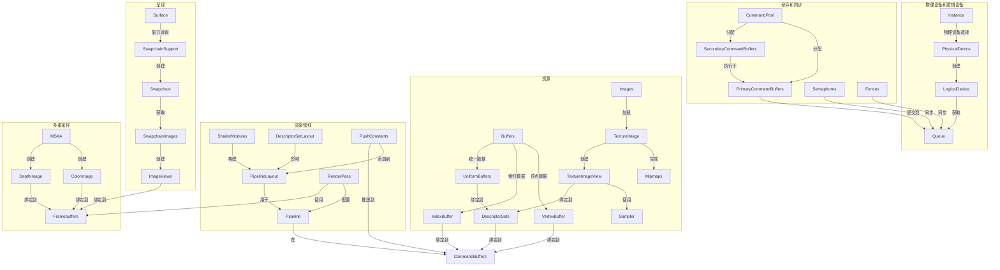

# Vulkan Tutorial in Rust

这个项目是Vulkan教程（<https://vulkan-tutorial.com/>）的Rust实现版本。

它旨在提供一个清晰、现代的示例，展示如何在Rust中使用Ash箱（crate）进行Vulkan绑定。

## 最新示例

目前已实现的主要示例包括：

- `26_texture_mapping`: 展示纹理映射
- `27_depth_buffering`: 实现深度缓冲
- `28_model_loading`: 演示3D模型加载
- `29_mipmapping`: 实现mipmap生成
- `30_multisampling`: 演示多重采样抗锯齿
- `31_push_constants`: 实现推送常量
- `32_recycling_command_buffers`: 演示命令缓冲区回收
- `33_secondary_command_buffers`: 使用次级命令缓冲区渲染多个模型

## 如何运行

1. **确保已安装并配置Vulkan SDK。**
    你需要将`glslc`（SPIR-V编译器）添加到PATH中，用于编译着色器。它通常包含在Vulkan SDK中。

2. **编译和运行：**
    要运行次级命令缓冲区示例，并查看详细的调试日志，请从项目根目录执行以下命令：

    ```bash
    RUST_LOG=debug cargo run --bin 33_secondary_command_buffers
    ```

    你可以根据需要将`debug`更改为其他日志级别，如`info`、`warn`或`error`。
    例如，仅查看信息级别的消息：

    ```bash
    RUST_LOG=info cargo run --bin 33_secondary_command_buffers
    ```

    如果未设置`RUST_LOG`环境变量，`pretty_env_logger`可能会默认使用更高的日志级别（例如，仅显示错误），此时你可能看不到应用程序的`info!`或`debug!`消息。

3. **交互控制：**
    - 在33_secondary_command_buffers示例中，使用左右箭头键可以控制显示的模型数量。

## 编译着色器

着色器（`assets/shaders/`目录中扩展名为`.vert`和`.frag`的文件）在构建过程中会通过`build.rs`脚本使用`glslc`自动编译为SPIR-V格式（`.spv`）。如果修改这些着色器源文件，Cargo会自动重新运行`build.rs`来重新编译它们。

## 项目复盘：33_secondary_command_buffers

`33_secondary_command_buffers.rs`是本教程的最终示例，它展示了如何使用次级命令缓冲区（Secondary Command Buffers）来并行渲染多个模型实例，并通过键盘交互控制实例数量。

### 核心功能

- 支持渲染多达4个独立的3D模型实例
- 每个模型具有不同的位置、旋转、缩放和透明度
- 使用次级命令缓冲区并行记录渲染命令
- 通过键盘左右箭头键控制模型数量
- 集成了之前所有示例的功能（纹理映射、深度缓冲、MSAA、Mipmaps等）

### Vulkan核心概念及拓扑关系

以下是Vulkan中的核心概念及其逻辑关系：



### Vulkan渲染流程

1. **初始化**：创建Instance、PhysicalDevice和LogicalDevice
2. **窗口集成**：创建Surface并设置Swapchain
3. **资源准备**：加载纹理和3D模型，创建各种缓冲区
4. **渲染设置**：创建RenderPass、Pipeline和DescriptorSets
5. **渲染循环**：
   - 获取下一个Swapchain图像
   - 更新命令缓冲区（将次级命令缓冲区执行于主命令缓冲区）
   - 更新统一缓冲区（矩阵变换）
   - 提交命令缓冲区到图形队列
   - 呈现到屏幕

### 次级命令缓冲区的优势

1. **并行记录**：多个次级命令缓冲区可以同时记录，提高CPU利用率
2. **重用**：次级命令缓冲区可以重复使用，减少记录开销
3. **模块化**：将不同的渲染任务分离到不同的次级命令缓冲区中
4. **效率**：可以在多个渲染过程中引用相同的次级命令缓冲区

在33_secondary_command_buffers示例中，每个模型实例都有自己的次级命令缓冲区，包含了该实例特定的变换和绘制命令，主命令缓冲区负责执行这些次级命令缓冲区。

### 实例数据管理

每个模型实例的变换数据通过推送常量传递给着色器：

- 模型矩阵：控制位置、旋转和缩放
- 不透明度：控制模型的透明度

模型布局被优化为围绕中心点的圆形分布，每个模型都有略微不同的高度、旋转轴、旋转速度和缩放因子，以增强视觉效果并避免Z轴冲突。

这种结构不仅展示了Vulkan的高级功能，也提供了一个良好的基础，可以在此基础上构建更复杂的3D应用程序。
