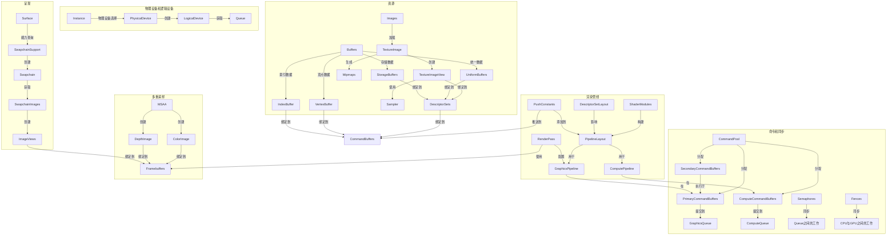

# Vulkan Tutorial in Rust

这个项目是 Vulkan 教程（<https://vulkan-tutorial.com/>）的 Rust 实现版本。

它旨在提供一个清晰、现代的示例，展示如何在 Rust 中使用 Ash 箱（crate）进行 Vulkan 绑定。

## 已实现示例

该项目已完整实现 Vulkan 教程的全部示例：

- `26_texture_mapping`: 展示纹理映射
- `27_depth_buffering`: 实现深度缓冲
- `28_model_loading`: 演示 3D 模型加载
- `29_mipmapping`: 实现 mipmap 生成
- `30_multisampling`: 演示多重采样抗锯齿
- `31_push_constants`: 实现推送常量
- `32_recycling_command_buffers`: 演示命令缓冲区回收
- `33_secondary_command_buffers`: 使用次级命令缓冲区渲染多个模型
- `34_compute_shaders`: 实现计算着色器处理粒子系统
- `35_combined_demo`: **综合演示** - 整合所有功能的完整示例

## 如何运行

1. **确保已安装并配置 Vulkan SDK**

   你需要将 `glslc`（SPIR-V 编译器）添加到 PATH 中，用于编译着色器。它通常包含在 Vulkan SDK 中。

2. **编译和运行示例**

   要运行特定示例并查看详细的调试日志，请从项目根目录执行以下命令：

   ```bash
   # 运行最新的综合演示
   RUST_LOG=debug cargo run --bin 35_combined_demo
   
   # 或运行之前的示例
   RUST_LOG=debug cargo run --bin 34_compute_shaders
   ```

   你可以根据需要将 `debug` 更改为其他日志级别，如 `info`、`warn` 或 `error`。
   例如，仅查看信息级别的消息：

   ```bash
   RUST_LOG=info cargo run --bin 35_combined_demo
   ```

   如果未设置 `RUST_LOG` 环境变量，`pretty_env_logger` 可能会默认使用更高的日志级别（例如，仅显示错误），此时你可能看不到应用程序的 `info!` 或 `debug!` 消息。

3. **交互控制**

   - **ESC** - 退出应用程序
   - **←/→** - 减少/增加模型数量 (1-10)
   - **F1** - 显示帮助信息
   - **F11** - 切换全屏模式

## 编译着色器

着色器（`assets/shaders/` 目录中扩展名为 `.vert`、`.frag` 和 `.comp` 的文件）在构建过程中会通过 `build.rs` 脚本使用 `glslc` 自动编译为 SPIR-V 格式（`.spv`）。如果修改这些着色器源文件，Cargo 会自动重新运行 `build.rs` 来重新编译它们。

## 主要示例介绍

### 综合演示 (35_combined_demo) - 推荐

`35_combined_demo.rs` 是本项目的最终示例，它整合了所有先前示例的功能，展示了一个完整的Vulkan应用程序。

**核心功能**：

- **多模型渲染系统**：使用次级命令缓冲区并行渲染多达 10 个独立的 3D 模型实例
- **GPU 粒子系统**：使用计算着色器实现高性能的粒子物理模拟（8192 个粒子）
- **高级渲染特性**：16x MSAA、深度测试、Alpha 混合、Mipmap 纹理
- **交互式控制**：键盘控制模型数量、全屏切换、实时帮助系统
- **性能优化**：多帧并行、资源池化、命令缓冲区重用

**技术特点**：

1. **计算与图形并行**：计算着色器与图形渲染管线并行工作
2. **资源管理**：智能的交换链重建和资源清理
3. **现代Vulkan实践**：使用 Vulkan 1.3 特性和最佳实践
4. **跨平台支持**：支持 Wayland 和 X11 窗口系统

### 次级命令缓冲区 (33_secondary_command_buffers)

`33_secondary_command_buffers.rs` 展示了如何使用次级命令缓冲区来并行渲染多个模型实例，并通过键盘交互控制实例数量。

**核心功能**：

- 支持渲染多达 4 个独立的 3D 模型实例
- 每个模型具有不同的位置、旋转、缩放和透明度
- 使用次级命令缓冲区并行记录渲染命令
- 通过键盘左右箭头键控制模型数量

**次级命令缓冲区的优势**：

1. **并行记录**：多个次级命令缓冲区可以同时记录，提高 CPU 利用率
2. **重用**：次级命令缓冲区可以重复使用，减少记录开销
3. **模块化**：将不同的渲染任务分离到不同的次级命令缓冲区中
4. **效率**：可以在多个渲染过程中引用相同的次级命令缓冲区

### 计算着色器 (34_compute_shaders)

`34_compute_shaders.rs` 展示了如何使用 Vulkan 的计算着色器功能实现高性能的粒子系统。

**核心功能**：

- 基于 GPU 加速的粒子系统实现
- 使用计算着色器进行粒子位置和速度更新
- 计算管线与图形管线并行工作
- 使用着色器存储缓冲区 (SSBO) 存储粒子数据
- 高效的帧间数据共享机制

**计算着色器的优势**：

1. **并行计算**：利用 GPU 的并行计算能力处理大量粒子
2. **与图形管线分离**：计算工作可与渲染工作并行执行
3. **灵活性**：可用于各种通用计算问题，不限于图形处理
4. **高性能**：适合大规模数据处理，如粒子系统、物理模拟等

## 应用程序架构

### 模块化设计

项目采用模块化设计，主要包含以下模块：

- **核心模块**：Vulkan 实例、设备、队列管理
- **资源模块**：缓冲区、图像、内存管理
- **模型系统**：3D 模型加载、顶点处理、渲染管线
- **粒子系统**：计算着色器、存储缓冲区、物理模拟
- **纹理系统**：图像加载、Mipmap 生成、采样器配置
- **窗口管理**：事件处理、交换链、全屏切换

### 性能特性

- **多帧并行**：使用飞行帧技术，CPU/GPU 并行工作
- **MSAA 抗锯齿**：支持最高 16x 多重采样
- **内存优化**：设备本地内存使用，减少传输开销
- **命令缓冲区优化**：主/次级命令缓冲区分离，提高并行度

## Vulkan 核心概念及拓扑关系

以下是 Vulkan 中的核心概念及其逻辑关系：


```mermaid
graph TD
    subgraph 物理设备和逻辑设备
        Instance-->|物理设备选择|PhysicalDevice
        PhysicalDevice-->|创建|LogicalDevice
        LogicalDevice-->|获取|Queue
    end
    
    subgraph 呈现
        Surface-->|能力查询|SwapchainSupport
        SwapchainSupport-->|创建|Swapchain
        Swapchain-->|获取|SwapchainImages
        SwapchainImages-->|创建|ImageViews
    end
    
    subgraph 渲染管线
        ShaderModules-->|构建|PipelineLayout
        DescriptorSetLayout-->|影响|PipelineLayout
        PushConstants-->|添加到|PipelineLayout
        PipelineLayout-->|用于|GraphicsPipeline
        PipelineLayout-->|用于|ComputePipeline
        RenderPass-->|配置|GraphicsPipeline
    end
    
    subgraph 资源
        Buffers-->|顶点数据|VertexBuffer
        Buffers-->|索引数据|IndexBuffer
        Buffers-->|统一数据|UniformBuffers
        Buffers-->|存储数据|StorageBuffers
        Images-->|加载|TextureImage
        TextureImage-->|生成|Mipmaps
        TextureImage-->|创建|TextureImageView
        TextureImageView-->|使用|Sampler
        TextureImageView-->|绑定到|DescriptorSets
        UniformBuffers-->|绑定到|DescriptorSets
        StorageBuffers-->|绑定到|DescriptorSets
    end
    
    subgraph 命令和同步
        CommandPool-->|分配|PrimaryCommandBuffers
        CommandPool-->|分配|SecondaryCommandBuffers
        CommandPool-->|分配|ComputeCommandBuffers
        SecondaryCommandBuffers-->|执行于|PrimaryCommandBuffers
        PrimaryCommandBuffers-->|提交到|GraphicsQueue
        ComputeCommandBuffers-->|提交到|ComputeQueue
        Semaphores-->|同步|Queue之间的工作
        Fences-->|同步|CPU与GPU之间的工作
    end
    
    subgraph 多重采样
        MSAA-->|创建|ColorImage
        MSAA-->|创建|DepthImage
        ColorImage-->|绑定到|Framebuffers
        DepthImage-->|绑定到|Framebuffers
        ImageViews-->|绑定到|Framebuffers
    end
    
    RenderPass-->|使用|Framebuffers
    GraphicsPipeline-->|在|PrimaryCommandBuffers
    ComputePipeline-->|在|ComputeCommandBuffers
    DescriptorSets-->|绑定到|CommandBuffers
    PushConstants-->|推送到|CommandBuffers
    VertexBuffer-->|绑定到|CommandBuffers
    IndexBuffer-->|绑定到|CommandBuffers
```

## Vulkan 渲染流程

1. **初始化**：创建 Instance、PhysicalDevice 和 LogicalDevice
2. **窗口集成**：创建 Surface 并设置 Swapchain
3. **资源准备**：加载纹理和 3D 模型，创建各种缓冲区
4. **渲染设置**：创建 RenderPass、Pipeline 和 DescriptorSets
5. **渲染循环**：
   - 获取下一个 Swapchain 图像
   - 执行计算着色器工作（粒子物理模拟）
   - 更新命令缓冲区
   - 更新统一缓冲区（矩阵变换）
   - 提交命令缓冲区到图形队列
   - 呈现到屏幕

## 系统要求

- **Vulkan 1.3** 兼容的 GPU
- **Rust 1.80+**
- **Vulkan SDK**（包含 glslc 编译器）
- **Linux**：支持 Wayland 和 X11
- **Windows/macOS**：基础支持（可能需要调整）

## 许可证

本项目遵循原 Vulkan 教程的许可证条款。

## 贡献

欢迎提交 Issues 和 Pull Requests 来改进这个项目！

---

**注意**：这是一个学习项目，主要用于理解 Vulkan API 的工作原理。在生产环境中使用前，请仔细审查代码并进行适当的优化。
