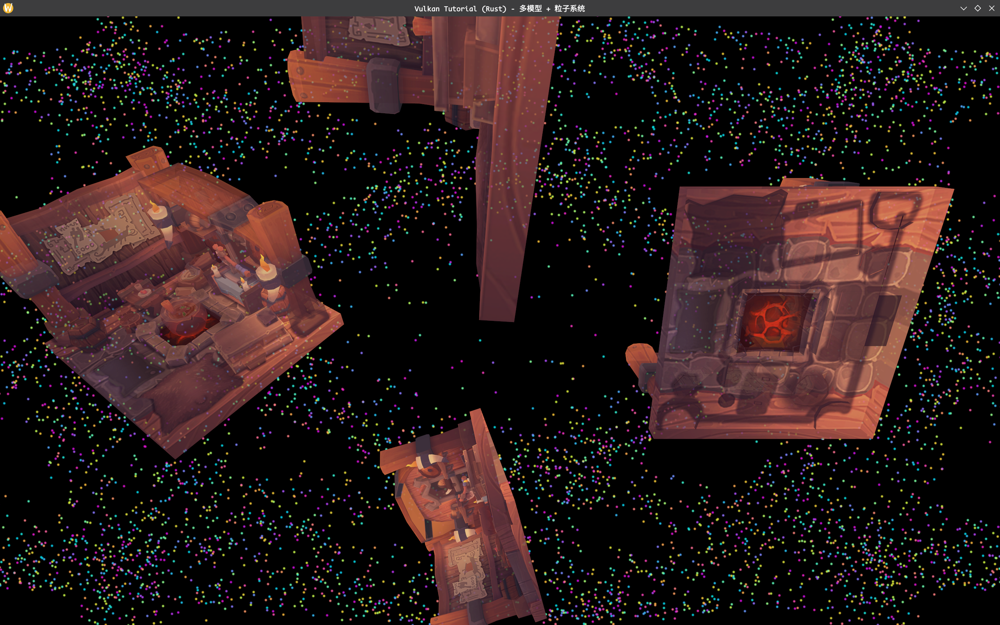

# Vulkan Tutorial in Rust - 模块化重构版 🚀

[](https://www.rust-lang.org)
[](https://www.vulkan.org)
[](LICENSE)

这个项目是 [Vulkan 教程](https://vulkan-tutorial.com/) 的 Rust 实现版本的**完全模块化重构**。

与原始教程不同，本项目将单一巨大源文件重构为现代化的模块体系，为 Vulkan 学习者和开发者提供了一个**生产级别的代码组织范例**。

## 🌟 项目特色

### 🎯 核心创新

- **🏗️ 完全模块化架构**：从原教程的单文件设计重构为现代化的模块体系
- **📦 生产级代码组织**：遵循 Rust 最佳实践，代码结构清晰易维护  
- **📚 渐进式学习路径**：从基础 Vulkan 概念到复杂综合演示的完整学习曲线
- **⚡ 现代 Vulkan 实践**：使用 Vulkan 1.3 特性和当代最佳实践

### 🎮 技术亮点

- **🔥 GPU 粒子系统**：8192 个粒子的实时物理模拟（计算着色器驱动）
- **🎯 多模型渲染**：最多 10 个独立模型实例并行渲染
- **🖼️ 高级图形特性**：16x MSAA、深度缓冲、Alpha 混合、Mipmap 纹理
- **⚡ 性能优化**：多帧并行、资源池化、命令缓冲区重用
- **🎮 交互式控制**：实时模型数量调整、全屏切换、帮助系统

## 📸 演示效果



## 📁 模块化架构设计

### 🏛️ 整体架构

```
src/
├── main.rs                   # 🚪 程序入口点和模块声明  
├── app.rs                    # 🪟 Winit 应用程序事件循环
├── vulkan_app.rs            # 🎯 VulkanApp 核心结构和生命周期
├── constants.rs             # 📊 全局常量和配置
├── types.rs                 # 📋 数据结构定义（顶点、UBO等）
├── errors.rs                # ❌ 错误类型和处理
├── vk_window.rs             # 🪟 窗口系统集成
├── vulkan/                  # 🔧 Vulkan 核心模块
│   ├── mod.rs               
│   ├── instance.rs          # 实例创建和调试
│   ├── device.rs            # 物理/逻辑设备管理
│   ├── swapchain.rs         # 交换链管理
│   ├── renderpass.rs        # 渲染通道和帧缓冲区
│   ├── commands.rs          # 命令池和命令缓冲区
│   └── sync.rs              # 同步对象管理
├── resources/               # 📦 资源管理模块
│   ├── mod.rs
│   ├── resources_buffer.rs  # 缓冲区管理
│   ├── resources_images.rs  # 图像和纹理管理
│   ├── memory.rs            # 内存分配和管理
│   ├── shader.rs            # 着色器加载和管理
│   └── resources_descriptor.rs # 描述符集管理
├── model/                   # 🎨 3D模型系统
│   ├── mod.rs
│   ├── model_loader.rs      # 模型数据加载（OBJ）
│   ├── model_buffers.rs     # 顶点/索引缓冲区
│   ├── model_descriptors.rs # 模型描述符管理
│   ├── model_pipeline.rs    # 模型渲染管线
│   └── model_renderer.rs    # 模型渲染逻辑
├── particle/                # ✨ GPU粒子系统
│   ├── mod.rs
│   ├── particle_buffers.rs  # 粒子存储缓冲区
│   ├── particle_descriptors.rs # 粒子描述符管理
│   ├── particle_pipeline.rs # 图形/计算管线
│   ├── compute.rs           # 计算着色器处理
│   └── particle_renderer.rs # 粒子渲染逻辑
└── texture/                 # 🖼️ 纹理系统
    ├── mod.rs
    ├── texture_loader.rs    # 纹理加载和解码
    ├── texture_images.rs    # 纹理图像管理
    └── sampler.rs           # 采样器配置
```

### 🧩 模块职责

| 模块 | 职责 | 核心功能 |
|------|------|----------|
| **vulkan/** | Vulkan 核心 API | 实例、设备、交换链、命令管理 |
| **resources/** | 资源管理 | 缓冲区、图像、内存、着色器 |
| **model/** | 3D 模型系统 | 模型加载、顶点处理、渲染管线 |
| **particle/** | 粒子系统 | 计算着色器、物理模拟、GPU 加速 |
| **texture/** | 纹理系统 | 图像加载、Mipmap、采样器配置 |

### 🔥 模块化重构亮点

相比原始的 Vulkan 教程单文件实现，我们实现了：

1. **职责分离**：每个模块负责特定功能域，代码内聚性高
2. **可维护性**：模块边界清晰，便于修改和扩展
3. **可重用性**：模块可以独立测试和在其他项目中重用
4. **团队协作**：不同开发者可以并行开发不同模块
5. **渐进学习**：学习者可以逐模块理解 Vulkan 概念

## 🚀 快速开始

### 📋 系统要求

- **Rust 1.80+**
- **Vulkan SDK** （包含 `glslc` 编译器）
- **支持 Vulkan 1.3** 的 GPU
- **Linux**: Wayland/X11 支持
- **Windows/macOS**: 基础支持

### 🛠️ 安装和运行

1. **克隆仓库**

   ```bash
   git clone https://github.com/Rukkhadevata123/vulkan-tutorial-rust.git
   cd vulkan-tutorial-rust
   ```

2. **确保 Vulkan SDK 已安装**

   ```bash
   # 检查 glslc 是否可用
   glslc --version
   ```

3. **编译和运行**

   ```bash
   # 运行综合演示（推荐）
   RUST_LOG=info cargo run --release
   
   # 或查看详细调试信息
   RUST_LOG=debug cargo run --release
   ```

### 🎮 交互控制

| 按键 | 功能 |
|------|------|
| **ESC** | 退出应用程序 |
| **←/→** | 减少/增加模型数量 (1-10) |
| **F1** | 显示帮助信息 |
| **F11** | 切换全屏模式 |

## 🎯 核心功能详解

### 🔥 GPU 粒子系统

- **8192 个粒子**实时物理模拟
- **计算着色器驱动**：利用 GPU 并行计算能力
- **双缓冲机制**：ping-pong 存储缓冲区实现
- **物理真实**：重力、碰撞、阻尼等物理效果

```glsl
// 计算着色器示例 - 粒子物理更新
#version 450

layout(local_size_x = 256, local_size_y = 1, local_size_z = 1) in;

layout(set = 0, binding = 1) readonly buffer ParticleSSBOIn {
    Particle particlesIn[];
};

layout(set = 0, binding = 2) writeonly buffer ParticleSSBOOut {
    Particle particlesOut[];
};

void main() {
    uint index = gl_GlobalInvocationID.x;
    if (index >= particlesIn.length()) return;
    
    // 物理模拟逻辑...
}
```

### 🎨 多模型渲染系统

- **最多 10 个模型实例**并行渲染
- **二级命令缓冲区**：优化渲染性能
- **独立变换**：每个模型独立的位置、旋转、缩放
- **动态透明度**：基于模型索引的透明度变化

### 🖼️ 高级图形特性

- **16x MSAA 抗锯齿**：自适应最大采样数
- **深度缓冲**：正确的深度测试和排序
- **Alpha 混合**：透明和半透明效果
- **Mipmap 纹理**：自动生成多级纹理

## 🏗️ Vulkan 概念和架构

### 核心概念拓扑关系


```mermaid
graph TD
    subgraph 物理设备和逻辑设备
        Instance-->|物理设备选择|PhysicalDevice
        PhysicalDevice-->|创建|LogicalDevice
        LogicalDevice-->|获取|Queue
    end
    
    subgraph 呈现
        Surface-->|能力查询|SwapchainSupport
        SwapchainSupport-->|创建|Swapchain
        Swapchain-->|获取|SwapchainImages
        SwapchainImages-->|创建|ImageViews
    end
    
    subgraph 渲染管线
        ShaderModules-->|构建|PipelineLayout
        DescriptorSetLayout-->|影响|PipelineLayout
        PushConstants-->|添加到|PipelineLayout
        PipelineLayout-->|用于|GraphicsPipeline
        PipelineLayout-->|用于|ComputePipeline
        RenderPass-->|配置|GraphicsPipeline
    end
    
    subgraph 资源
        Buffers-->|顶点数据|VertexBuffer
        Buffers-->|索引数据|IndexBuffer
        Buffers-->|统一数据|UniformBuffers
        Buffers-->|存储数据|StorageBuffers
        Images-->|加载|TextureImage
        TextureImage-->|生成|Mipmaps
        TextureImage-->|创建|TextureImageView
        TextureImageView-->|使用|Sampler
        TextureImageView-->|绑定到|DescriptorSets
        UniformBuffers-->|绑定到|DescriptorSets
        StorageBuffers-->|绑定到|DescriptorSets
    end
    
    subgraph 命令和同步
        CommandPool-->|分配|PrimaryCommandBuffers
        CommandPool-->|分配|SecondaryCommandBuffers
        CommandPool-->|分配|ComputeCommandBuffers
        SecondaryCommandBuffers-->|执行于|PrimaryCommandBuffers
        PrimaryCommandBuffers-->|提交到|GraphicsQueue
        ComputeCommandBuffers-->|提交到|ComputeQueue
        Semaphores-->|同步|Queue之间的工作
        Fences-->|同步|CPU与GPU之间的工作
    end
```

### 渲染流程

1. **初始化阶段**
   - 创建 Vulkan 实例、物理设备选择
   - 逻辑设备创建和队列获取
   - 窗口表面和交换链设置

2. **资源准备阶段**
   - 加载 3D 模型和纹理资源
   - 创建顶点、索引、统一和存储缓冲区
   - 设置渲染通道和图形管线

3. **渲染循环**

   ```rust
   loop {
       // 1. 获取下一个交换链图像
       let image_index = acquire_next_image()?;
       
       // 2. 执行计算着色器（粒子物理）
       submit_compute_commands()?;
       
       // 3. 更新统一缓冲区（MVP 矩阵）
       update_uniform_buffers()?;
       
       // 4. 录制渲染命令
       record_command_buffers(image_index)?;
       
       // 5. 提交到图形队列
       submit_graphics_commands()?;
       
       // 6. 呈现到屏幕
       present_image(image_index)?;
   }
   ```

## 🔧 技术实现细节

### 多帧并行技术

使用"飞行帧"技术实现 CPU/GPU 并行：

```rust
const MAX_FRAMES_IN_FLIGHT: usize = 2;

struct VulkanApp {
    frame: usize,
    in_flight_fences: Vec<vk::Fence>,
    image_available_semaphores: Vec<vk::Semaphore>,
    render_finished_semaphores: Vec<vk::Semaphore>,
}

impl VulkanApp {
    fn render(&mut self) -> Result<()> {
        // 等待当前帧的围栏
        self.device.wait_for_fences(&[self.in_flight_fences[self.frame]], true, u64::MAX)?;
        
        // 渲染当前帧...
        
        // 切换到下一帧
        self.frame = (self.frame + 1) % MAX_FRAMES_IN_FLIGHT;
        Ok(())
    }
}
```

### 资源管理策略

- **内存类型优化**：根据用途选择最适合的内存类型
- **缓冲区池化**：重用命令缓冲区和描述符集
- **自动清理**：RAII 模式确保资源正确释放

### 性能优化特性

- **批量渲染**：二级命令缓冲区并行录制
- **GPU 端计算**：粒子物理完全在 GPU 执行
- **内存带宽优化**：最小化 CPU-GPU 数据传输

## 🎓 学习路径建议

### 初学者路径

1. **理解模块结构**：从 `main.rs` 开始，了解整体架构
2. **Vulkan 基础**：学习 `vulkan/` 模块的实例和设备管理
3. **资源管理**：掌握 `resources/` 模块的缓冲区和图像处理
4. **简单渲染**：理解 `model/` 模块的基础 3D 渲染

### 进阶路径

1. **计算着色器**：深入 `particle/` 模块的 GPU 计算
2. **高级特性**：学习 `texture/` 模块的 Mipmap 和采样
3. **性能优化**：理解多帧并行和命令缓冲区优化
4. **自定义扩展**：基于模块化架构添加新功能

## 💡 开发者指南

### 添加新功能

1. **确定功能域**：选择合适的模块或创建新模块
2. **定义接口**：在 `types.rs` 中添加相关数据结构
3. **实现功能**：在对应模块中实现核心逻辑
4. **集成测试**：在 `vulkan_app.rs` 中集成新功能

### 调试技巧

```bash
# 启用 Vulkan 验证层
export VK_LAYER_PATH=$VULKAN_SDK/etc/vulkan/explicit_layer.d
RUST_LOG=debug cargo run

# 性能分析
cargo build --release
perf record --call-graph=dwarf ./target/release/vulkan-tutorial-rust
```

## 📊 项目统计

- **总代码行数**: ~3000+ 行 Rust 代码
- **模块数量**: 6 个主要模块，36 个源文件
- **功能特性**: 10+ 个 Vulkan 高级特性
- **性能指标**: 8192 粒子 @ 60+ FPS（取决于硬件）

## 🤝 贡献指南

我们欢迎各种形式的贡献！

1. **Bug 报告**：使用 GitHub Issues 报告问题
2. **功能请求**：提出新功能建议
3. **代码贡献**：提交 Pull Request
4. **文档改进**：完善代码注释和文档

### 贡献流程

1. Fork 本仓库
2. 创建功能分支: `git checkout -b feature/amazing-feature`
3. 提交更改: `git commit -m '添加惊人的新功能'`
4. 推送到分支: `git push origin feature/amazing-feature`
5. 提交 Pull Request

## 📄 许可证

本项目遵循 MIT 许可证 - 查看 [LICENSE](LICENSE) 文件了解详情。

## 🙏 致谢

- **Vulkan Tutorial** - 原始教程提供了优秀的学习资源
- **Ash Crate** - 提供了优质的 Vulkan Rust 绑定
- **Rust 社区** - 提供了丰富的生态系统支持

---

**⚠️ 重要提醒**：这是一个教育项目，主要用于学习 Vulkan API 和现代图形编程概念。在生产环境中使用前，请进行充分的测试和优化。

**🎯 项目目标**：通过模块化的代码组织，让 Vulkan 学习变得更加结构化和可管理，同时展示如何构建可维护的大型图形应用程序。
