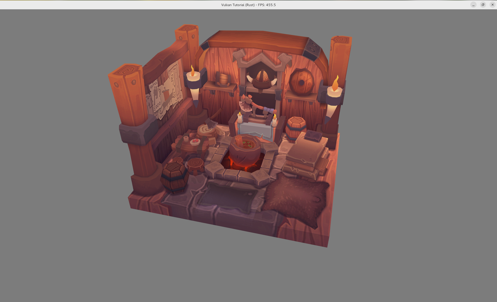
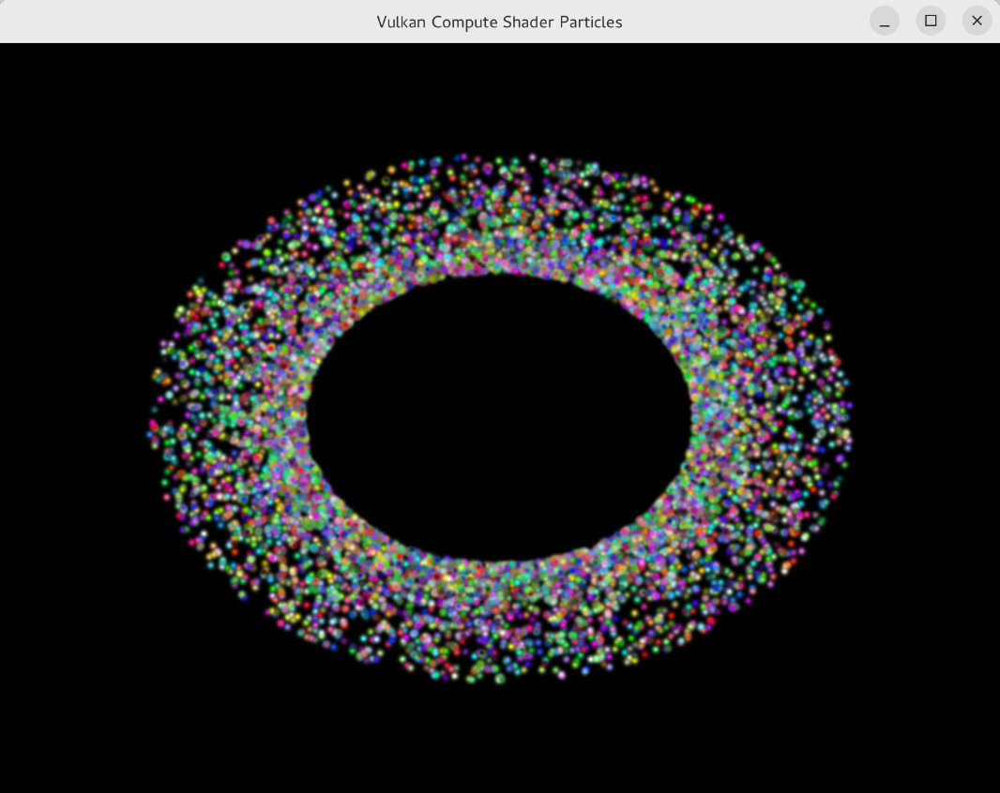
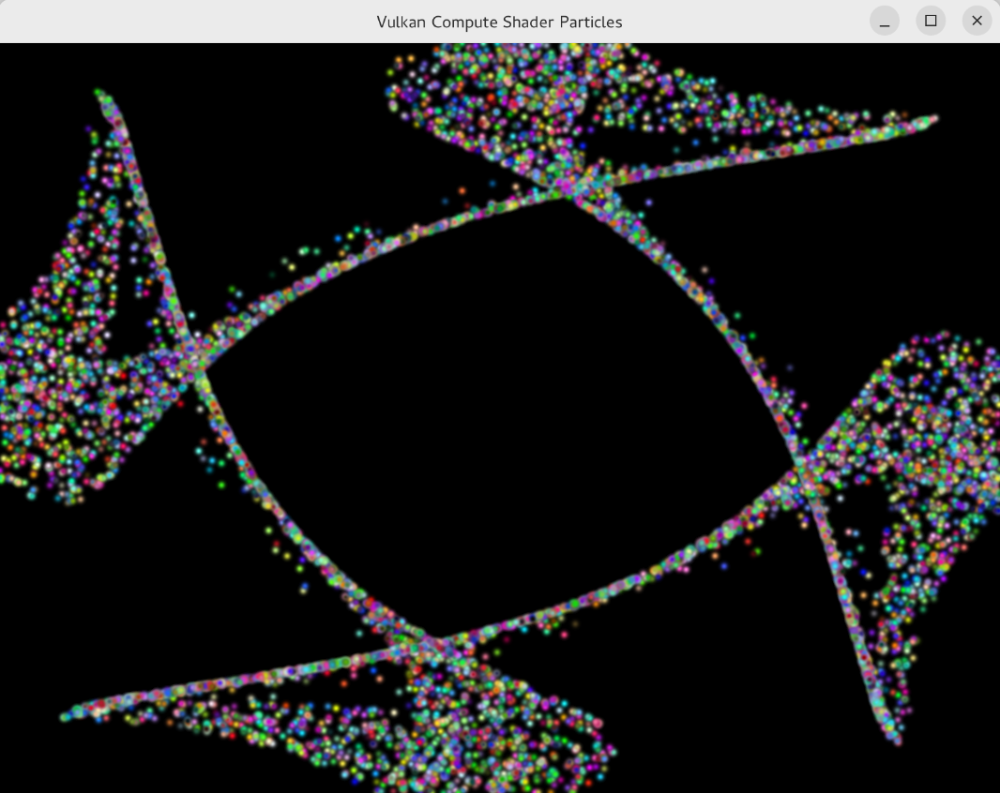
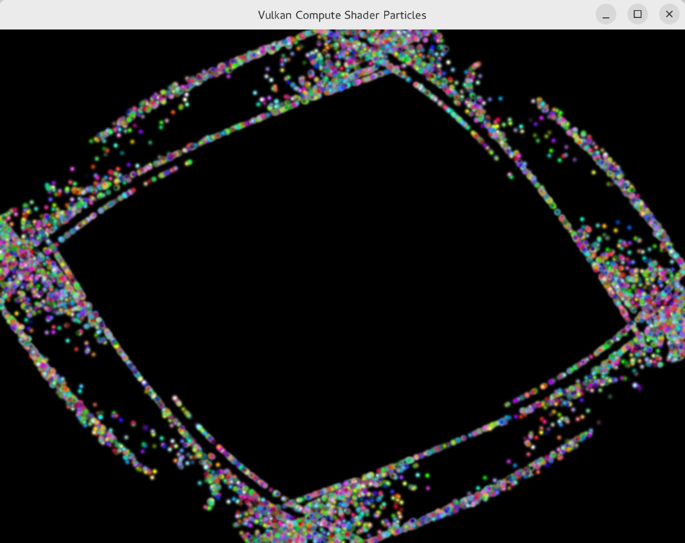

# Vulkan Tutorial in Rust

This repository contains a Rust implementation of Vulkan applications using the `vulkano` wrapper. It is designed to provide clear, practical examples of modern Vulkan graphic and compute pipelines, moving beyond basic initialization to functional rendering and simulation.

# Ongoing Project

This project is continuously updated. New examples, architectural improvements, and advanced features will be added over time to cover broader aspects of the Vulkan API.

# Examples Overview

## 1. Viking Room (`viking_room`)

This example demonstrates a complete 3D rendering pipeline. It renders a textured 3D model (the classic Viking Room) with proper depth buffering and perspective projection.

**Key Features:**

- **Model Loading**: parses vertex and index data from glTF files.
- **Texture Mapping**: loads images and applies samplers for texture rendering.
- **Uniform Buffers**: utilizes Uniform Buffer Objects (UBO) to pass Model-View-Projection (MVP) matrices to the shader.
- **Dynamic Rendering**: simplified rendering loop without explicit Render Pass objects, utilizing Vulkan 1.3 dynamic rendering features.
- **MSAA**: Multi-Sample Anti-Aliasing for smoother edges.



## 2. Compute Shader Particles (`compute_shader`)

This example focuses on General-Purpose GPU (GPGPU) programming. It simulates a particle system where the physics calculations (velocity, position updates) are performed entirely on the GPU using a compute shader.

**Key Features:**

- **Compute Pipeline**: separates physics simulation from graphics rendering.
- **Storage Buffers (SSBO)**: uses Shader Storage Buffer Objects to share particle data (position, velocity, color) between the compute shader and the graphics pipeline.
- **Synchronization**: manages memory barriers and execution dependencies between compute and graphics queue submissions.
- **Color Gradients**: particles change color based on their spatial attributes dynamically.





# Vulkan Concepts Summary

Understanding Vulkan requires grasping its explicit nature. Below is a summary of the core concepts utilized in this codebase.

### Initialization

- **Instance**: The connection between the application and the Vulkan library. It initializes the loader and enables global extensions (like validation layers).
- **Physical Device**: Represents the actual GPU hardware. We query its properties (name, type, limits) to select the most suitable device.
- **Logical Device**: The software interface to the physical device. It is where we create resources (buffers, images) and fetch **Queues** for submitting commands.

### Resources & Memory

- **Buffers**: Linear blocks of memory used for vertex data, indices, or uniform variables.
- **Images**: Multidimensional arrays of data, used for textures, depth attachments, and swapchain targets.
- **Descriptors**: Opaque objects that describe how shaders access resources. Sets of descriptors are bound to the pipeline to provide textures or buffer data during execution.

### Pipelines

- **Graphics Pipeline**: A state machine that defines how vertices are processed and rasterized into pixels. It includes fixed-function states (input assembly, rasterizer, depth stencil) and programmable stages (vertex and fragment shaders).
- **Compute Pipeline**: A simpler pipeline dedicated to computational tasks. It does not use the rasterization engine and operates on arbitrary data structures via dispatch commands.

### Presentation

- **Surface**: An abstraction of the OS-native window where images can be rendered.
- **Swapchain**: A queue of images waiting to be presented to the screen. It manages the synchronization between the GPU rendering rate and the display refresh rate (VSync).

### Command Execution

- **Command Buffers**: Vulkan is asynchronous. Commands (draw, dispatch, copy) are recorded into command buffers and then submitted to a queue for execution.
- **Synchronization**:
  - **Fences**: Used to synchronize the CPU with the GPU (e.g., waiting for a frame to finish rendering before recording the next one).
  - **Semaphores**: Used to synchronize operations within the GPU (e.g., ensuring the compute shader finishes writing to the buffer before the vertex shader reads from it).

# Quick Start

## Prerequisites

- **Rust Toolchain**: Ensure you have the latest stable Rust installed.
- **Vulkan SDK**: Required for validaton layers and shader compilation tools.
- **Slang (Optional)**: If you intend to compile the `.slang` shaders manually.

## Shader Compilation

To compile the Slang shaders into SPIR-V format compatible with Vulkan, use the following `slangc` command:

```bash
slangc assets/shaders/shader_compute.slang \
    -target spirv \
    -profile spirv_1_4 \
    -emit-spirv-directly \
    -fvk-use-entrypoint-name \
    -entry vertMain \
    -entry fragMain \
    -entry compMain \
    -o assets/shaders/shader_compute.spv
```

## Running the Examples

You can run the examples directly using Cargo. Build in release mode for optimal performance.

**Run the Compute Shader Particle System:**

```bash
cargo run --release --bin compute_shader
```

**Run the Viking Room Renderer:**

```bash
cargo run --release --bin viking_room
```

# Acknowledgments

- **Vulkan Tutorial**: <https://docs.vulkan.org/tutorial/latest/00_Introduction.html>
- **Vulkano**: <https://github.com/vulkano-rs/vulkano>
