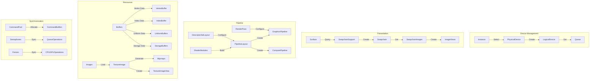

# Vulkan Tutorial in Rust - Modular Architecture

[](https://www.rust-lang.org)
[](https://www.vulkan.org)
[](LICENSE)

A modular Rust implementation of the [Vulkan Tutorial](https://vulkan-tutorial.com/), refactored from a monolithic single-file design into a production-ready modular architecture.

## Demos


## Features

### Core Capabilities

- **Modular Architecture**: Organized into focused modules for maintainability
- **GPU Particle System**: 8192 particles with compute shader-driven physics
- **Multi-Model Rendering**: Support for up to 10 concurrent model instances  
- **Advanced Graphics**: 16x MSAA, depth buffering, alpha blending, mipmapped textures
- **Performance Optimized**: Multi-frame in-flight, resource pooling, command buffer reuse

### Technical Highlights

- **Modern Vulkan 1.3**: Latest API features and best practices
- **Compute Pipeline**: GPU-accelerated particle physics simulation
- **Secondary Command Buffers**: Parallel command recording for models
- **Explicit Resource Management**: Precise control over GPU memory and synchronization

## Project Structure

```
src/
├── main.rs                   # Program entry point
├── app.rs                    # Winit event loop integration
├── vulkan_app.rs            # Core VulkanApp lifecycle management
├── constants.rs             # Global configuration
├── types.rs                 # Data structures (vertices, UBOs, etc.)
├── errors.rs                # Error handling
├── vulkan/                  # Core Vulkan API modules
│   ├── instance.rs          # Instance creation and debug setup
│   ├── device.rs            # Physical/logical device management
│   ├── swapchain.rs         # Swapchain and presentation
│   ├── renderpass.rs        # Render passes and framebuffers
│   ├── commands.rs          # Command pools and buffers
│   └── sync.rs              # Synchronization primitives
├── resources/               # Resource management
│   ├── resources_buffer.rs  # Buffer allocation and management
│   ├── resources_images.rs  # Image and texture handling
│   ├── memory.rs            # Memory allocation utilities
│   └── shader.rs            # Shader compilation and loading
├── model/                   # 3D model rendering system
│   ├── model_loader.rs      # OBJ file parsing
│   ├── model_buffers.rs     # Vertex/index buffer management
│   ├── model_pipeline.rs    # Graphics pipeline setup
│   └── model_renderer.rs    # Rendering logic
├── particle/                # GPU particle system
│   ├── particle_buffers.rs  # Storage buffer management
│   ├── particle_pipeline.rs # Graphics/compute pipeline setup
│   ├── compute.rs           # Compute shader execution
│   └── particle_renderer.rs # Particle rendering
└── texture/                 # Texture system
    ├── texture_loader.rs    # Image loading and decoding
    ├── texture_images.rs    # Texture image management
    └── sampler.rs           # Sampler configuration
```

## Quick Start

### Requirements

- Rust 1.80+
- Vulkan SDK (including `glslc` compiler)
- Vulkan 1.3 compatible GPU
- Linux: Wayland/X11 support

### Build and Run

```bash
# Clone repository
git clone https://github.com/Rukkhadevata123/vulkan-tutorial-rust.git
cd vulkan-tutorial-rust

# Verify Vulkan SDK installation
glslc --version

# Run the application
RUST_LOG=info cargo run --release
```

### Controls

- **ESC**: Exit application
- **←/→**: Decrease/increase model count (1-10)
- **F1**: Show help
- **F11**: Toggle fullscreen

## Core Systems

### GPU Particle System

The particle system demonstrates compute shader usage for physics simulation:

```glsl
#version 450
layout(local_size_x = 256, local_size_y = 1, local_size_z = 1) in;

layout(set = 0, binding = 1) readonly buffer ParticleSSBOIn {
    Particle particlesIn[];
};

layout(set = 0, binding = 2) writeonly buffer ParticleSSBOOut {
    Particle particlesOut[];
};

void main() {
    uint index = gl_GlobalInvocationID.x;
    if (index >= particlesIn.length()) return;
    
    // Physics simulation: gravity, collision, damping
    Particle p = particlesIn[index];
    p.velocity.y -= 9.8 * deltaTime;
    p.position += p.velocity * deltaTime;
    
    particlesOut[index] = p;
}
```

### Multi-Model Rendering

Models are rendered using secondary command buffers for optimal performance:

```rust
// Secondary command buffer recording
for model_idx in 0..self.models {
    let secondary_buffer = self.data.secondary_command_buffers[image_index][model_idx];
    
    // Record model-specific commands
    self.device.cmd_bind_descriptor_sets(
        secondary_buffer,
        vk::PipelineBindPoint::GRAPHICS,
        self.data.model_pipeline_layout,
        0,
        &[self.data.model_descriptor_sets[image_index]],
        &[],
    );
    
    self.device.cmd_draw_indexed(secondary_buffer, self.data.indices.len() as u32, 1, 0, 0, model_idx as u32);
}
```

## Vulkan Architecture

### Resource Relationships


```mermaid
graph TD
    subgraph "Device Management"
        Instance-->|Select|PhysicalDevice
        PhysicalDevice-->|Create|LogicalDevice
        LogicalDevice-->|Get|Queue
    end
    
    subgraph "Presentation"
        Surface-->|Query|SwapchainSupport
        SwapchainSupport-->|Create|Swapchain
        Swapchain-->|Get|SwapchainImages
        SwapchainImages-->|Create|ImageViews
    end
    
    subgraph "Pipeline"
        ShaderModules-->|Build|PipelineLayout
        DescriptorSetLayout-->|Configure|PipelineLayout
        PipelineLayout-->|Create|GraphicsPipeline
        PipelineLayout-->|Create|ComputePipeline
        RenderPass-->|Configure|GraphicsPipeline
    end
    
    subgraph "Resources"
        Buffers-->|Vertex Data|VertexBuffer
        Buffers-->|Index Data|IndexBuffer
        Buffers-->|Uniform Data|UniformBuffers
        Buffers-->|Storage Data|StorageBuffers
        Images-->|Load|TextureImage
        TextureImage-->|Generate|Mipmaps
        TextureImage-->|Create|TextureImageView
    end
    
    subgraph "Synchronization"
        CommandPool-->|Allocate|CommandBuffers
        Semaphores-->|Sync|QueueOperations
        Fences-->|Sync|CPUGPUOperations
    end
```

### Rendering Pipeline Flow

1. **Initialization Phase**

   ```rust
   // Create Vulkan instance and select physical device
   let instance = create_instance()?;
   let physical_device = pick_physical_device(&instance)?;
   let device = create_logical_device(&instance, physical_device)?;
   
   // Setup swapchain and render targets
   let swapchain = create_swapchain(&device)?;
   let render_pass = create_render_pass(&device)?;
   ```

2. **Resource Setup**

   ```rust
   // Load models and textures
   load_model_data(&mut data, model_config)?;
   load_texture(&instance, &device, &mut data, texture_config)?;
   
   // Create GPU buffers
   create_vertex_buffer(&instance, &device, &mut data)?;
   create_uniform_buffers(&instance, &device, &mut data)?;
   create_particle_storage_buffers(&instance, &device, &mut data)?;
   ```

3. **Main Render Loop**

   ```rust
   loop {
       // 1. Acquire next swapchain image
       let image_index = acquire_next_image(swapchain, image_available_semaphore)?;
       
       // 2. Wait for previous frame completion
       device.wait_for_fences(&[in_flight_fence], true, u64::MAX)?;
       device.reset_fences(&[in_flight_fence])?;
       
       // 3. Update uniform buffers (MVP matrices, time, etc.)
       update_uniform_buffers(device, &data, image_index)?;
       
       // 4. Record and submit compute commands (particle physics)
       let compute_submit = SubmitInfo::default()
           .command_buffers(&[compute_command_buffer])
           .signal_semaphores(&[compute_finished_semaphore]);
       
       device.queue_submit(compute_queue, &[compute_submit], null_fence)?;
       
       // 5. Record and submit graphics commands
       let graphics_submit = SubmitInfo::default()
           .wait_semaphores(&[image_available_semaphore, compute_finished_semaphore])
           .wait_dst_stage_mask(&[COLOR_ATTACHMENT_OUTPUT, VERTEX_INPUT])
           .command_buffers(&[graphics_command_buffer])
           .signal_semaphores(&[render_finished_semaphore]);
       
       device.queue_submit(graphics_queue, &[graphics_submit], in_flight_fence)?;
       
       // 6. Present rendered image
       let present_info = PresentInfoKHR::default()
           .wait_semaphores(&[render_finished_semaphore])
           .swapchains(&[swapchain])
           .image_indices(&[image_index]);
       
       swapchain_device.queue_present(present_queue, &present_info)?;
   }
   ```

## Performance Features

### Multi-Frame In-Flight

```rust
const MAX_FRAMES_IN_FLIGHT: usize = 2;

// Allows CPU to prepare next frame while GPU processes current frame
struct SyncObjects {
    image_available_semaphores: Vec<vk::Semaphore>,
    render_finished_semaphores: Vec<vk::Semaphore>,
    compute_finished_semaphores: Vec<vk::Semaphore>,
    in_flight_fences: Vec<vk::Fence>,
}
```

### Resource Management

- **Memory Type Optimization**: Select appropriate memory types for different use cases
- **Buffer Pooling**: Reuse command buffers and descriptor sets
- **Staging Buffers**: Efficient GPU memory uploads via temporary host-visible buffers

### GPU Compute Integration

- **Compute-Graphics Synchronization**: Proper semaphore usage between compute and graphics queues
- **Ping-Pong Buffers**: Alternate between storage buffers for particle simulation
- **Workgroup Optimization**: 256 threads per workgroup for optimal GPU utilization

## Learning Path

### Beginner

1. Study `vulkan/` modules for core Vulkan concepts
2. Understand `resources/` for buffer and memory management
3. Explore `model/` for basic 3D rendering pipeline

### Intermediate

1. Examine `particle/` for compute shader integration
2. Study synchronization in render loop
3. Understand descriptor set management

### Advanced

1. Implement custom compute shaders
2. Add new rendering features
3. Optimize performance bottlenecks

## Development

### Adding New Features

1. Identify appropriate module or create new one
2. Define data structures in `types.rs`
3. Implement core logic in module
4. Integrate in `vulkan_app.rs`

### Debugging

```bash
# Enable Vulkan validation layers
RUST_LOG=debug cargo run

# Performance profiling
cargo build --release
perf record ./target/release/vulkan-tutorial-rust
```

## Contributing

1. Fork the repository
2. Create feature branch: `git checkout -b feature/new-feature`
3. Commit changes: `git commit -m 'Add new feature'`
4. Push to branch: `git push origin feature/new-feature`
5. Submit Pull Request

## License

This project is licensed under the MIT License - see [LICENSE](LICENSE) for details.

## Acknowledgments

- [Vulkan Tutorial](https://vulkan-tutorial.com/) - Original learning resource
- [Ash](https://github.com/MaikKlein/ash) - Rust Vulkan bindings
- Rust graphics community for ecosystem support
