## Vulkan核心概念深度解析：从初始化到渲染

Vulkan是一个显式（Explicit）的图形和计算API，它的核心设计哲学是：**将最大限度的控制权交给开发者**。这意味着你需要“手动”处理许多在旧API（如OpenGL）中由驱动程序自动完成的工作。这样做的回报是无与伦比的性能和跨平台的一致性。

为了驾驭这种复杂性，我们将一个Vulkan程序的生命周期解构为三个逻辑阶段：

1. **初始化阶段 (Initialization)**: 搭建应用程序与硬件之间的桥梁。
2. **准备阶段 (Preparation)**: 预先配置和烘焙（Bake）所有渲染所需的资源和状态。这是Vulkan性能的精髓所在。
3. **渲染循环 (Render Loop)**: 高效地执行渲染指令，并将最终画面呈现出来。

---

### 阶段一：初始化 —— 建立与世界的连接

这个阶段只在程序启动时执行一次，目标是建立应用与Vulkan驱动和物理硬件之间的联系。可以将其比作“公司开业”：你需要注册公司、考察场地、装修办公室、并接通水电网络。

| 概念 | 描述与拓展 | 关系与目的 |
| :--- | :--- | :--- |
| **`VkInstance`** | **Vulkan的“总开关”与运行时上下文**。这是你创建的第一个、也是最重要的对象之一，代表了你的应用程序与整个Vulkan运行时的连接。可以把它想象成**加载Vulkan驱动库（`vulkan-1.dll`, `libvulkan.so.1`）并初始化的句柄**。创建时，你需要通过 `VkInstanceCreateInfo` 结构体告诉Vulkan： 1. **你的应用信息** (`VkApplicationInfo`)：应用名、版本等，有助于驱动进行针对性优化。 2. **要启用的扩展 (Extensions)**：例如，用于窗口显示的 `VK_KHR_surface` 和针对特定平台（如Windows、Linux）的表面扩展。 3. **要启用的层 (Layers)**：最重要的就是**验证层 (`VK_LAYER_KHRONOS_validation`)**。它就像一个实时调试器，能捕获API的误用并给出详细的错误信息，是Vulkan开发中不可或缺的工具。 | **一切的根源**。`Instance` 是一个全局上下文，所有后续对象（包括物理设备、逻辑设备等）都直接或间接地从它派生。没有 `Instance`，你就无法与Vulkan世界进行任何沟通。 |
| **`VkPhysicalDevice`** | **物理设备的“简历”**。这代表系统中一个具体的、支持Vulkan的硬件，通常就是你的GPU。你不能“创建”它，而是从 `Instance` 中**枚举 (enumerate)** 出来，就像HR筛选收到的多份简历一样。对于每个 `PhysicalDevice`，你必须仔细审查它的“简历”内容： 1. **属性 (Properties)**：设备名称、供应商ID、设备类型（集成/独立）、驱动版本、各种限制（如最大纹理尺寸）。 2. **特性 (Features)**：硬件是否支持某些高级功能，如几何着色器、多视口渲染、采样率着色、各向异性过滤等。 3. **队列族 (Queue Families)**：设备支持哪些类型的指令队列（如图形、计算、传输、呈现）。选择一个同时支持图形和呈现操作的队列族是渲染程序的常见要求。 | **硬件的抽象**。`Instance` 可能会找到多个 `PhysicalDevice`（例如，Intel集显和NVIDIA独显）。你的责任是编写逻辑来**挑选（Pick）**一个最合适的设备。这个选择过程是Vulkan底层控制权的体现，也是编写健壮程序的第一步。 |
| **`VkDevice`** | **打开并使用的逻辑设备**。在选定一个 `PhysicalDevice` 后，你需要创建一个 `VkDevice` 来真正地“打开”并使用它。这可以看作是你和硬件签订的一份“合同”。在创建时，你必须通过 `VkDeviceCreateInfo` 明确声明： 1. **你要使用的队列**：从选定的 `PhysicalDevice` 的队列族中，具体申请哪几个队列，优先级如何。 2. **你要启用的特性**：你在“简历”中看到的那些特性，只有在这里明确启用了，才能在后续代码中使用。例如，即使硬件支持各向异性过滤，如果你创建 `Device` 时没有启用它，后续创建采样器时也无法使用该功能。 | **操作硬件的句柄**。`VkDevice` 是你后续进行绝大部分操作的“工厂”和上下文。所有核心的渲染对象，如 `Buffer`、`Image`、`Pipeline`、`Semaphore` 等，都由 `VkDevice` 创建。它是你代码中最常出现的参数之一，代表了你与选定GPU的活动会话。 |
| **`VkQueue`** | **GPU的任务提交通道**。队列是用于向GPU提交已经录制好的指令的通道。你不能“创建”队列，而是在创建 `Device` 后，根据你申请的数量和类型，从 `Device` 中**获取 (get)** 它们的句柄。所有实际的工作——渲染、计算、内存传输——都是通过将**命令缓冲区 (CommandBuffer)** 提交到 `Queue` 来触发执行的。 | **GPU的工作流水线**。获取到 `Queue` 句柄后，它就成了你和GPU沟通的主要渠道。你可以向图形队列提交绘图命令，向计算队列提交并行计算任务，从而实现复杂的异步工作流。例如，在一个队列中进行计算密集型的后处理，同时在另一个队列中渲染下一帧的UI。 |

---

### 阶段二：准备工作 —— 布置渲染舞台

这是Vulkan的核心，也是其复杂性的主要来源。在进入渲染循环之前，你需要创建和配置好渲染一帧所需的所有“原材料”（资源）和“流程图”（管线状态）。这个阶段的目标是**将所有可能的状态和配置预先“烘焙”成固定的对象**，从而让渲染循环中的指令执行达到最高效率。

#### 2.1 资源与内存 (Resources & Memory)

| 概念 | 描述与拓展 | 关系与目的 |
| :--- | :--- | :--- |
| **`VkBuffer`** & **`VkImage`** | **GPU数据的“蓝图”**。`Buffer` 是一块通用的一维线性数据容器，用于存储顶点、索引、统一变量（UBO）、存储数据（SSBO）等。`Image` 是结构化的、可包含多维度（1D/2D/3D）、多层（Array Layers）、多级渐远（MIP Levels）的数据，主要用于纹理和帧缓冲附件。**核心要点**：调用 `vkCreateBuffer` 或 `vkCreateImage` **仅仅是创建了一个元数据对象（蓝图），它描述了数据的规格，但并未分配任何实际的GPU内存**。 | **GPU数据的抽象**。它们定义了数据应如何被GPU解释和访问。但它们只是空壳，需要与实际的内存绑定后才能使用。 |
| **`VkDeviceMemory`** | **实际的GPU内存块**。这代表了从GPU显存或系统内存中实际分配出来的一块内存。Vulkan要求你手动管理内存： 1. **查询内存类型**：从 `PhysicalDevice` 查询可用的内存堆（Heaps，如VRAM、系统RAM）和内存类型（Types），每种类型都有不同的属性，如`DEVICE_LOCAL`（高速设备内存）、`HOST_VISIBLE`（CPU可访问）、`HOST_COHERENT`（无需手动刷新缓存）。 2. **分配内存**：选择合适的内存类型，调用 `vkAllocateMemory` 分配一块 `VkDeviceMemory`。 3. **绑定内存**：使用 `vkBindBufferMemory` 或 `vkBindImageMemory` 将之前创建的 `Buffer` 或 `Image` “蓝图”与这块实际内存的某个偏移量绑定起来。 **现代实践**：手动管理成百上千个小内存块非常低效且容易出错。强烈推荐使用**Vulkan Memory Allocator (VMA)** 这类库，它能帮你智能地管理内存，在大型内存块中进行子分配，极大地简化了内存管理工作。 | **数据的物理载体**。这是Vulkan底层控制权的又一体现。通过手动管理，你可以实现精妙的内存布局优化，例如将静态的顶点数据放入速度最快的`DEVICE_LOCAL`内存中，而将需要CPU频繁更新的UBO放入`HOST_VISIBLE`内存中。 |
| **`VkImageView`** & **`VkBufferView`** | **资源的“镜头”或“解释器”**。`Image` 或 `Buffer` 本身不能直接被着色器或管线使用，必须通过一个“视图”来访问。`ImageView` 描述了**如何“看待”一个`Image`**： • 它可以只关注`Image`的一部分，例如一个3D纹理的某个切片，或一个纹理数组的某一图层。 • 它可以重新解释`Image`的格式，例如将一个 `R8G8B8A8_UNORM` 格式的图像作为 `R8G8B8A8_SRGB` 来读取。 • 它指定了组件的映射（Swizzling）。 `ImageView` 是连接`Image`资源和`Framebuffer`、`DescriptorSet`的桥梁。 | **资源的访问接口**。这种分离提供了极大的灵活性。例如，同一个深度图像资源，可以创建一个用于深度测试的 `ImageView`（作为深度附件），再创建另一个 `ImageView`（作为纹理）让着色器读取深度值以实现阴影映射。视图本身不占用额外内存，只是一个轻量级的元数据描述。 |

#### 2.2 呈现与交换链 (Presentation & Swapchain)

| 概念 | 描述与拓展 | 关系与目的 |
| :--- | :--- | :--- |
| **`VkSurfaceKHR`** | **窗口的“停靠港”**。这是一个与平台窗口系统（如Windows的`HWND`，Linux的X11/Wayland窗口）绑定的对象，代表了你想要将渲染结果绘制到的屏幕区域。它是一个跨平台的抽象，通过 `KHR` 扩展提供，是连接Vulkan内部世界和外部操作系统窗口的桥梁。 | **窗口的Vulkan表示**。由 `Instance` 和平台相关的窗口句柄创建。它是创建 `Swapchain` 的必要前提。 |
| **`VkSwapchainKHR`** | **画面的“传送带”或“旋转门”**。这是一个由多张图像（`Image`）组成的集合，用于实现双缓冲或三缓冲等平滑的呈现技术。**特殊之处**：交换链中的这些 `Image` 是由显示系统为你创建和管理的，你不需要手动为它们分配 `DeviceMemory`。你的工作流程是： 1. 向交换链**请求（Acquire）**一张可以用于渲染的图像。 2. 将你的渲染结果绘制到这张图像上。 3. 将这张图像**呈现（Present）**回交换链，让显示系统将其显示在屏幕上。 | **渲染结果的出口**。由 `Device` 和 `Surface` 创建。它负责处理与显示驱动和操作系统的复杂同步，确保你能平滑地更新屏幕内容而避免画面撕裂。你从交换链获取的 `Image` 也需要通过 `ImageView` 来访问。 |

#### 2.3 着色器与数据描述 (Shaders & Data Descriptors) - 定义“契约”

这部分定义了GPU将如何处理数据，以及CPU如何将数据提供给GPU。

| 概念 | 描述与拓展 | 关系与目的 |
| :--- | :--- | :--- |
| **`VkShaderModule`** | **编译好的着色器代码块**。Vulkan不直接使用高级着色语言（如GLSL或HLSL），而是使用一种名为 **SPIR-V** 的标准二进制中间格式。你的工作流是：用GLSL/HLSL/Slang编写着色器 -> 使用编译器（如`glslc`, `slangc`）将其编译成SPIR-V字节码 -> 将这些字节码加载到你的程序中，并创建 `VkShaderModule` 对象。它代表了一段已编译、已验证但尚未链接到渲染管线的着色器代码。 | **管线的可执行逻辑**。它本身不能执行，是创建 `Pipeline` 时不可或缺的“原料”之一。一个 `ShaderModule` 可以包含多个入口点，尽管通常一个模块只用于一个着色器阶段（顶点、片段等）。 |
| **`VkDescriptorSetLayout`** | **资源接口的“模板”或“函数签名”**。这是Vulkan中一个极其重要的概念。它**描述**了一个着色器期望绑定的资源集合的**布局**，但不涉及任何具体的资源。例如，一个 `Layout` 可以规定：“这个集合在绑定点0需要一个UBO供顶点着色器使用，在绑定点1需要一个组合图像采样器供片段着色器使用”。它定义了管线和外部资源之间的**“契约”**。 | **管线与资源的契约**。它是创建 `PipelineLayout` 的基础，也是分配 `DescriptorSet` 的模板。一个设计良好的 `DescriptorSetLayout` 可以在多个不同的管线和资源集之间复用。 |
| **`VkDescriptorPool`** | **描述符集的“工厂”**。这是一个内存池，专门用于分配 `DescriptorSet`。在创建时，你需要告诉Vulkan这个池子最大能容纳多少个`DescriptorSet`，以及各类描述符（如UBO、采样器）的总数。 | **描述符的分配器**。所有的 `DescriptorSet` 都必须从一个 `DescriptorPool` 中分配。当不再需要这些Set时，你可以将它们释放回池中，或者直接重置整个池。 |
| **`VkDescriptorSet`**| **资源接口的“实例”**。如果 `Layout` 是模板，那么 `Set` 就是这个模板的一个具体实例。你从 `DescriptorPool` 中根据一个 `Layout` 分配出一个 `Set`。此时它还是空的，你需要调用 `vkUpdateDescriptorSets` 函数，将**具体的资源视图**（`VkBuffer`的描述信息、`VkImageView`和`VkSampler`）“写入”到这个 `Set` 中，填充模板中定义的各个绑定点。 | **资源的具体实例集合**。这个 `Set` 在录制命令时通过 `vkCmdBindDescriptorSets` 绑定到管线，从而让着色器能够真正访问到你指定的那个UBO、那张纹理。一个 `Set` 绑定了一组逻辑上相关的资源。 |
| **`VkSampler`**| **纹理的“读取方式”**。它是一个独立的状态对象，定义了如何对一个`Image`进行采样（读取）。它包含： • **过滤 (Filtering)**：`NEAREST`(近邻) 或 `LINEAR`(线性)。 • **寻址模式 (Addressing)**：`REPEAT`, `CLAMP_TO_EDGE` 等。 • **各向异性过滤 (Anisotropy)** 等高级设置。 | **纹理读取的配置**。它与 `ImageView` 分离，提供了更大的灵活性。你可以用同一个 `Sampler` 去采样多张不同的纹理，也可以用多个不同的 `Sampler`（例如，一个用于平铺，一个用于边缘裁剪）去采样同一张纹理。 |

#### 2.4 渲染流程与管线 (Render Process & Pipeline) - 烘焙“工作流”

| 概念 | 描述与拓展 | 关系与目的 |
| :--- | :--- | :--- |
| **`VkRenderPass`**| **渲染操作的“结构化食谱”**。它描述了一组渲染操作的结构，但不关心具体的`Image`。它定义了： 1. **附件 (Attachments)**：将使用多少个附件（如一个颜色附件、一个深度附件），它们的格式是什么，是否需要多重采样。 2. **附件操作**：在`RenderPass`开始时对附件做什么（`LOAD_OP_CLEAR`清除、`LOAD_OP_LOAD`加载已有内容），结束后做什么（`STORE_OP_STORE`保存结果）。 3. **子通道 (Subpasses)**：一个`RenderPass`可以分为多个子通道。例如，一个子通道进行G-Buffer渲染，下一个子通道进行光照计算。子通道间的依赖关系让GPU能高效地进行优化，例如将中间结果直接保存在高速的片上内存中。 | **渲染操作的蓝图**。`RenderPass` 是创建 `Framebuffer` 和 `GraphicsPipeline` 时必须提供的对象。它告诉驱动渲染的整体结构，使得驱动可以提前进行优化。它是Vulkan区别于旧API的一个核心特征，强制你对渲染流程进行结构化思考。 |
| **`VkFramebuffer`**| **渲染目标的“具体配餐”**。如果 `RenderPass` 是食谱，那么 `Framebuffer` 就是将具体的“食材”(`ImageView`)端上桌，对应食谱中的每一道菜（附件）。它将一个或多个具体的 `ImageView`（例如，一个来自交换链的`ImageView`作为颜色目标，一个你自己创建的深度`ImageView`作为深度目标）与一个 `RenderPass` 中定义的附件进行绑定。 | **渲染目标的集合**。在开始一个`RenderPass`时 (`vkCmdBeginRenderPass`)，你必须提供一个与该`RenderPass`兼容的`Framebuffer`。`Framebuffer`的附件数量、格式、采样数都必须与`RenderPass`的定义完全匹配。 |
| **`VkPipelineLayout`** | **管线的“资源接口”**。它定义了管线可以访问的所有外部资源，由两部分组成： 1. 一组 **`DescriptorSetLayout`**：定义了管线将要绑定的所有描述符集（UBO、纹理等）的布局。 2. **推送常量 (Push Constants)**：一种用于传递少量、频繁更新数据（如单个物体的变换矩阵）的超轻量级机制。 | **管线的外部接口定义**。创建`Pipeline`时必须提供。它连接了管线的内部逻辑（着色器）和外部数据（`DescriptorSet`和推送常量）。 |
| **`VkPipeline`** | **GPU状态的“终极快照” (PSO)**。这是Vulkan中**最核心、最庞大**的对象。它将渲染一个物体所需的**几乎所有状态**“烘焙”成一个巨大的、不可变的对象。这包括： • **着色器阶段** (`VkShaderModule`和入口点)。 • **顶点输入状态** (顶点属性如何绑定)。 • **输入组装** (图元拓扑：点/线/三角形)。 • **所有固定功能状态**：光栅化、多重采样、深度/模板测试、颜色混合等。 • **它所兼容的`RenderPass`和`PipelineLayout`**。 由于所有状态都提前确定，驱动可以在创建时进行深度优化，使得在渲染时切换`Pipeline`的成本极低。 | **GPU状态的集合体**。你需要为你场景中的每一种渲染状态组合（例如，一个用于不透明物体，一个用于透明物体，一个用于线框模式）创建一个独立的`Pipeline`对象。在渲染循环中，你只需通过`vkCmdBindPipeline`一个指令，就能切换整个GPU的状态，这是Vulkan高性能的关键。**现代实践**：使用 `VkPipelineCache` 可以显著加快管线的创建速度，尤其是在程序重复启动时。 |

---

### 阶段三：渲染循环 —— 执行与同步

当所有准备工作就绪后，你就可以进入主循环，每帧向GPU提交真正的绘图命令。这个阶段强调的是高效的执行和精确的同步。

| 概念 | 描述与拓展 | 关系与目的 |
| :--- | :--- | :--- |
| **`VkCommandPool`**| **命令缓冲区的“内存池”**。用于分配`CommandBuffer`的内存池。它与一个特定的**队列族**绑定，这意味着从它分配的`CommandBuffer`只能提交到该队列族的队列中。命令池也可以被重置，从而一次性回收所有从它分配的`CommandBuffer`，这是一种高效的管理方式。 | **CommandBuffer的分配器**。你需要为每个线程创建一个`CommandPool`，如果它们需要同时录制命令。 |
| **`VkCommandBuffer`**| **GPU指令的“录制清单”**。这是你记录所有GPU命令的地方。你调用各种`vkCmd...`函数（如 `vkCmdBeginRenderPass`, `vkCmdBindPipeline`, `vkCmdBindDescriptorSets`, `vkCmdDraw`）来向其中填充指令。**这仅仅是录制，并不会立即执行**。这种CPU录制、GPU执行的异步模型是所有现代图形API的核心。 | **指令的集合**。录制完成后，你将一个或多个`CommandBuffer`打包提交到`Queue`中执行。你可以预先录制好多个`CommandBuffer`，然后在渲染循环中根据需要重用它们，从而极大地减少CPU开销。 |
| **`VkFence`** | **GPU到CPU的“信号旗”**。用于**GPU通知CPU**某项工作已经完成。当你向`vkQueueSubmit`提交工作时，可以附带一个`Fence`。CPU可以调用`vkWaitForFences`来等待这个`Fence`被GPU触发。一旦触发，CPU就知道之前提交的所有工作都已完成。 | **CPU等待GPU的同步原语**。**典型用例**：在渲染循环的开始，等待上一帧的`Fence`，以确保上一帧使用的`CommandBuffer`和其它资源现在可以安全地被重用。 |
| **`VkSemaphore`**| **GPU内部的“接力棒”**。用于**GPU内部任务之间，或不同队列之间**的同步。它完全在GPU端工作，CPU无法直接等待它。`vkQueueSubmit`可以配置为**等待**一个或多个`Semaphore`，并在工作完成后**触发**另一个或多个`Semaphore`。 | **GPU任务间的同步原语**。**典型用例**： 1. **图像获取与渲染同步**：`vkAcquireNextImageKHR`返回一个`imageAvailableSemaphore`。渲染队列提交时必须**等待**这个信号量，以确保图像已经可以被渲染。 2. **渲染与呈现同步**：渲染队列完成后**触发**一个`renderFinishedSemaphore`。呈现队列提交时必须**等待**这个信号量，以确保画面已经画好，可以显示在屏幕上。 |
| **`VkEvent`**| **更细粒度的“同步点”**。比`Semaphore`更轻量、更细粒度的同步原语。它可以在`CommandBuffer`内部的任意点被GPU设置或等待（`vkCmdSetEvent`, `vkCmdWaitEvents`），也可以被CPU查询和控制。 | **灵活的GPU/CPU同步点**。用于更复杂的同步场景，例如在一个`CommandBuffer`内部，需要等待另一个队列中某个特定点的工作完成。在基础教程中较少使用。 |

---

### 总结与思维导图：一帧的生命周期

为了将所有概念融会贯通，我们来走一遍一个典型帧的完整流程：

1. **(CPU) 等待上一帧完成**:
    * `vkWaitForFences(frameInFlightFence)`: CPU在此阻塞，等待上一帧提交给GPU的所有工作（渲染、计算等）彻底完成。这确保了我们即将重用的`CommandBuffer`和`UniformBuffer`等资源处于空闲状态。
    * `vkResetFences(frameInFlightFence)`: 将信号旗放倒，准备用于新的一帧。

2. **(CPU) 从交换链获取图像**:
    * `vkAcquireNextImageKHR(...) -> imageAvailableSemaphore`: 向交换链请求一张可供渲染的图像。此操作是异步的，Vulkan会返回一个`imageAvailableSemaphore`。当GPU准备好这张图像时，这个信号量会被触发。

3. **(CPU) 更新资源**:
    * 更新UBO（Uniform Buffer Object）：计算当前帧的视图、投影矩阵等，并将数据`memcpy`到与当前帧关联的`UniformBuffer`的映射内存中。

4. **(CPU) 录制命令缓冲区 (`VkCommandBuffer`)**:
    * `vkResetCommandBuffer(...)`: 重置命令缓冲区，清空上一帧的指令。
    * `vkBeginCommandBuffer(...)`: 开始录制。
    * `vkCmdBeginRenderPass(...)`: 开始渲染通道，指定要使用的`RenderPass`和`Framebuffer`（该`Framebuffer`必须包含从交换链获取的那个`ImageView`）。
    * `vkCmdBindPipeline(...)`: 绑定`GraphicsPipeline`。对于场景中的每种不同材质或渲染状态的物体，可能需要绑定不同的管线。
    * `vkCmdBindDescriptorSets(...)`: 绑定包含UBO、纹理等具体资源的`DescriptorSet`。
    * `vkCmdDrawIndexed(...)` / `vkCmdDraw(...)`: **发出绘图指令！**
    * ... (可以继续绑定不同的管线/资源/绘制其他物体) ...
    * `vkCmdEndRenderPass()`: 结束渲染通道。
    * `vkEndCommandBuffer()`: 结束录制。

5. **(CPU) 提交命令到GPU队列**:
    * `vkQueueSubmit(graphicsQueue, ...)`: 这是最关键的提交操作。你需要指定：
        * **要执行的`CommandBuffer`**。
        * **要等待的`Semaphore`**: `imageAvailableSemaphore`。这告诉GPU，必须等交换链图像准备好后，才能开始执行`CommandBuffer`中的渲染指令。
        * **要触发的`Semaphore`**: `renderFinishedSemaphore`。当`CommandBuffer`中的所有指令执行完毕后，这个信号量将被触发。
        * **要触发的`Fence`**: `frameInFlightFence`。这个`Fence`也将在所有工作完成后被触发，用于通知CPU。

6. **(CPU) 提交呈现请求**:
    * `vkQueuePresentKHR(presentQueue, ...)`: 将渲染完成的图像交还给交换链进行显示。你需要指定：
        * **要呈现的交换链和图像索引**。
        * **要等待的`Semaphore`**: `renderFinishedSemaphore`。这告诉呈现引擎，必须等渲染操作全部完成后，才能将这张图像显示在屏幕上，从而避免画面撕裂。

7. **循环**: 程序返回到步骤1，开始准备下一帧。

```mermaid
graph TD
    subgraph "阶段一：初始化 (建立连接)"
        direction LR
        A_Start[应用程序启动] --> B_Instance(VkInstance);
        B_Instance -- 扩展/层 --> B_ExtLayers["Extensions & Layers"];
        B_Instance -->|创建| C_Surface(VkSurfaceKHR);
        B_Instance -.->|枚举| D_PhysicalDevice(VkPhysicalDevice);
        D_PhysicalDevice -->|创建| E_Device(VkDevice);
        E_Device -->|获取| F_Queue((VkQueue));
        
        style B_Instance fill:#2E86C1,stroke:#1B4F72,color:white
        style E_Device fill:#3498DB,stroke:#1B4F72,color:white
    end

    subgraph "阶段二：准备工作 (资源与状态烘焙)"
        direction TB

        subgraph "2A. 资源与内存 (数据容器)"
            E_Device --> G_Buffer[VkBuffer];
            E_Device --> H_Image[VkImage];
            E_Device -->|分配| I_DeviceMemory(VkDeviceMemory);
            D_PhysicalDevice -.->|提供内存类型| I_DeviceMemory;
            
            G_Buffer -- 绑定到 --> I_DeviceMemory;
            H_Image -- 绑定到 --> I_DeviceMemory;
            
            H_Image -->|创建视图| J_ImageView(VkImageView);
        end
        
        subgraph "2B. 呈现 (与窗口系统交互)"
            C_Surface -->|用于创建| K_Swapchain(VkSwapchainKHR);
            E_Device -->|创建| K_Swapchain;
            K_Swapchain -.->|提供托管的| H_SwapchainImage["VkImage (Swapchain)"];
            H_SwapchainImage -->|创建视图| J_SwapchainImageView(VkImageView);
        end

        subgraph "2C. 着色器与数据描述 (资源契约)"
            L_Spirv["SPIR-V 字节码"] -->|加载到| M_ShaderModule(VkShaderModule);
            E_Device -->|创建| M_ShaderModule;
            
            E_Device -->|创建模板| N_DescLayout(VkDescriptorSetLayout);
            E_Device -->|创建池| O_DescPool(VkDescriptorPool);
            O_DescPool -- 分配 --> P_DescSet(VkDescriptorSet);
            N_DescLayout -.->|作为模板| P_DescSet;
            
            E_Device -->|创建| Q_Sampler(VkSampler);
            
            P_DescSet -- 更新以指向 --> J_ImageView;
            P_DescSet -- 更新以指向 --> Q_Sampler;
            P_DescSet -- 更新以指向 --> G_Buffer;
        end
        
        subgraph "2D. 渲染流程与管线 (状态烘焙)"
            E_Device -->|创建蓝图| R_RenderPass(VkRenderPass);
            J_SwapchainImageView -->|附加到| S_Framebuffer(VkFramebuffer);
            R_RenderPass -.->|定义结构| S_Framebuffer;
            E_Device -->|创建| S_Framebuffer;

            N_DescLayout -->|组成| T_PipelineLayout(VkPipelineLayout);
            E_Device -->|创建| T_PipelineLayout;

            T_PipelineLayout -->|定义接口| U_Pipeline(VkPipeline);
            R_RenderPass -.->|定义兼容性| U_Pipeline;
            M_ShaderModule -->|提供代码| U_Pipeline;
            E_Device -->|**烘焙**| U_Pipeline;
        end
        
        style U_Pipeline fill:#1E8449,stroke:#0E6251,color:white
    end
    
    subgraph "阶段三：渲染循环 (执行与同步)"
        direction TB
        E_Device -->|创建池| V_CommandPool(VkCommandPool);
        V_CommandPool -- 分配 --> W_CommandBuffer((VkCommandBuffer));

        W_CommandBuffer -->|记录绑定| U_Pipeline;
        W_CommandBuffer -->|记录绑定| P_DescSet;
        W_CommandBuffer -->|记录| X_DrawCmds["vkCmdDraw / DrawIndexed"];
        W_CommandBuffer -- 提交到 --> F_Queue;

        subgraph "同步原语"
            direction LR
            E_Device --> Y_Fence(VkFence);
            E_Device --> Z_Semaphore(VkSemaphore);
            F_Queue -- "GPU-CPU 同步" --> Y_Fence;
            F_Queue -- "GPU-GPU 同步" --> Z_Semaphore;
        end

        style W_CommandBuffer fill:#F39C12,stroke:#AF601A,color:white
        style F_Queue fill:#F39C12,stroke:#AF601A,color:white
    end
```

