## Vulkan 核心概念深度解析：从初始化到渲染

Vulkan 是一个显式的图形和计算 API，其核心设计哲学在于赋予开发者对硬件最大限度的控制权。这要求开发者手动管理资源、同步和状态，作为回报，Vulkan 提供了卓越的性能潜力与跨平台一致性。

为了系统性地理解 Vulkan，我们将一个典型程序的生命周期解构为三个逻辑阶段：

1. **初始化阶段 (Initialization)**: 建立应用程序与 Vulkan 驱动及物理硬件的连接。
2. **准备阶段 (Preparation)**: 预先配置和创建渲染所需的所有资源和状态对象。这是 Vulkan 高性能设计的精髓。
3. **渲染循环 (Render Loop)**: 高效地录制、提交并同步渲染指令。

---

### 阶段一：初始化 —— 建立与世界的连接

此阶段在程序启动时执行一次，目标是建立一个有效的 Vulkan 工作环境。

| 概念 | 描述与拓展 | 关系与目的 |
| :--- | :--- | :--- |
| **`VkInstance`** | **Vulkan 运行时上下文**。这是创建的第一个 Vulkan 对象，代表应用程序与 Vulkan 运行时的连接。它由 Vulkan 加载器 (Loader) 协调，用于发现并加载系统中的驱动程序。创建时需提供： 1. **`VkApplicationInfo`**: 应用程序元数据，有助于驱动进行针对性优化。 2. **启用的扩展 (Extensions)**: 用于启用标准之外的功能，如与窗口系统交互的 `VK_KHR_surface` 扩展。 3. **启用的层 (Layers)**: 用于注入额外的功能，其中**验证层 (`VK_LAYER_KHRONOS_validation`)** 至关重要，它能拦截 API 调用，报告不规范用法和潜在错误，是开发阶段的必备工具。 | **所有 Vulkan 操作的根句柄**。`Instance` 是一个全局上下文，后续的物理设备枚举、表面创建等操作都依赖于它。 |
| **`VkPhysicalDevice`** | **物理硬件的句柄**。代表系统中一个具体的、支持 Vulkan 的硬件设备 (GPU)。它不是被“创建”的，而是从 `VkInstance` 中**枚举 (enumerate)** 出来的。开发者必须查询其属性以评估其适用性： 1. **属性 (Properties)**: 设备名称、ID、类型 (集成/独立)、驱动版本以及各种实现限制 (limits)。 2. **特性 (Features)**: 硬件支持的可选功能，如 `samplerAnisotropy` (各向异性过滤) 或 `geometryShader` (几何着色器)。 3. **队列族 (Queue Families)**: 硬件支持的指令队列类型，如 `GRAPHICS`, `COMPUTE`, `TRANSFER`, `PRESENT`。选择合适的队列族是初始化的关键步骤。 | **硬件能力的抽象表示**。一个系统可能存在多个物理设备。应用程序需要编写逻辑来选择最合适的 `PhysicalDevice` 用于后续操作。 |
| **`VkDevice`** | **逻辑设备会话**。代表与一个 `VkPhysicalDevice` 的活动会话。创建 `VkDevice` 意味着正式启用并与该硬件进行交互。创建时必须明确指定： 1. **要创建的队列**: 从 `PhysicalDevice` 的队列族中具体申请哪些队列及其数量。 2. **要启用的特性**: 只有在此处明确启用的 `PhysicalDevice` 特性，才能在后续的程序中使用。未启用的特性即便硬件支持也无法使用。 | **核心操作句柄**。`VkDevice` 是创建绝大多数 Vulkan 对象（如缓冲区、图像、管线、同步原语等）的工厂。它是执行 Vulkan 操作时最核心和最频繁使用的对象。 |
| **`VkQueue`** | **指令提交通道**。代表一个 GPU 的硬件执行队列。队列句柄在创建 `VkDevice` 后从中**获取 (get)**，而非直接创建。所有 GPU 的实际工作（渲染、计算等）都是通过将**命令缓冲区 (CommandBuffer)** 提交到 `VkQueue` 来触发执行的。 | **GPU 的工作流水线**。获取队列句柄后，它便成为 CPU 向 GPU 委派任务的通道。利用不同的队列（如图形和计算队列）可以实现复杂的异步工作流，以最大化硬件利用率。 |

---

### 阶段二：准备工作 —— 布置渲染舞台

此阶段在进入渲染循环前执行，核心思想是将所有渲染状态和资源预先配置和“烘焙”为不可变或管理高效的对象，从而最小化渲染循环中的 CPU 开销。

#### 2.1 资源与内存 (Resources & Memory)

| 概念 | 描述与拓展 | 关系与目的 |
| :--- | :--- | :--- |
| **`VkBuffer`** & **`VkImage`** | **GPU 资源句柄**。`Buffer` 定义了一块一维线性数据，用于顶点、索引、统一变量 (UBO) 等。`Image` 定义了结构化的多维数据（纹理、附件）。创建这些对象仅是定义了资源的**属性**（尺寸、格式、用途等），并**不分配实际的 GPU 内存**。 | **GPU 数据的抽象定义**。它们是需要与物理内存绑定的“空壳”，定义了数据将如何被 GPU 解释和使用。 |
| **`VkDeviceMemory`** | **设备内存块**。代表从 GPU 内存堆 (Heap) 中分配的一块实际内存。开发者需手动执行三步操作： 1. **查询内存类型**: 从 `PhysicalDevice` 查询可用的内存类型及其属性（如 `DEVICE_LOCAL`, `HOST_VISIBLE`, `HOST_COHERENT`）。 2. **分配内存**: 调用 `vkAllocateMemory` 分配一块 `VkDeviceMemory`。 3. **绑定内存**: 调用 `vkBindBufferMemory` 或 `vkBindImageMemory` 将资源句柄与内存块绑定。 **现代实践**: 为避免管理大量小内存块带来的开销和复杂性，强烈推荐使用 **Vulkan Memory Allocator (VMA)** 库进行高效的子分配管理。 | **GPU 资源的物理载体**。手动内存管理赋予了开发者极致的优化能力，例如将静态资源置于高速设备本地内存，将需频繁更新的数据置于主机可见内存。 |
| **`VkImageView`** & **`VkBufferView`** | **资源的访问视图**。`Image` 或 `Buffer` 不能直接用于渲染管线，必须通过一个“视图”来指定其访问方式。`ImageView` 定义了**如何解释一个 `Image`**，例如： • 将其视为特定格式（如 SRGB）。 • 访问其特定的 Mipmap 层级或数组成员。 • 将一个 2D 纹理数组解释为一个立方体贴图 (Cubemap)。 `ImageView` 是连接 `Image` 与 `Framebuffer` 及 `DescriptorSet` 的桥梁。 | **资源的访问接口**。视图提供了极大的灵活性，允许同一个底层 `Image` 资源以不同方式用于不同目的（如同时作为渲染目标和采样纹理），而无需复制数据。 |

#### 2.2 呈现与交换链 (Presentation & Swapchain)

| 概念 | 描述与拓展 | 关系与目的 |
| :--- | :--- | :--- |
| **`VkSurfaceKHR`** | **原生渲染表面**。一个与平台原生窗口系统（如 Windows HWND）绑定的抽象对象，代表了渲染结果的目标显示区域。它是 Vulkan 与操作系统窗口管理器之间的接口。 | **窗口的 Vulkan 表示**。由 `Instance` 和平台相关信息创建，是创建 `Swapchain` 的必要前提。 |
| **`VkSwapchainKHR`** | **可呈现图像的集合**。管理一组用于屏幕显示的图像，是实现**双重缓冲**和**三重缓冲**等技术的机制。其图像由显示系统管理，开发者无需手动为其分配内存。其工作流程是：**请求 (Acquire)** 一张可用的图像进行渲染，完成后**呈现 (Present)** 回交换链以供显示。创建时可指定**呈现模式**（如`FIFO`强制垂直同步，`MAILBOX`实现三重缓冲以减少延迟）。 | **渲染结果的输出通道**。由 `Device` 和 `Surface` 创建。它负责处理复杂的显示同步，避免画面撕裂，并管理图像的所有权转换。 |

#### 2.3 着色器与数据描述 (Shaders & Data Descriptors)

| 概念 | 描述与拓展 | 关系与目的 |
| :--- | :--- | :--- |
| **`VkShaderModule`** | **着色器代码模块**。Vulkan 的着色器使用标准的 **SPIR-V** 二进制中间格式。`VkShaderModule` 对象由 SPIR-V 字节码创建，代表了一段已编译、可供管线使用的着色器代码。 | **管线的可执行逻辑单元**。它本身不可执行，而是作为创建 `VkPipeline` 时的一个关键组件。 |
| **`VkDescriptorSetLayout`** | **描述符集布局**。定义了一组资源绑定（Descriptor Bindings）的**接口签名**。它描述了着色器期望在特定集合（Set）和绑定点（Binding）上访问的资源类型（如 UBO, 组合采样器）、数量以及它们对哪个着色器阶段可见。 | **管线与资源的契约模板**。它是创建 `PipelineLayout` 的基础，并作为分配 `DescriptorSet` 的模板。良好的布局设计（如按更新频率划分 Set）是高效渲染的关键。 |
| **`VkDescriptorPool`** | **描述符池**。一个用于分配 `DescriptorSet` 的内存池。创建时需指定该池能容纳的 `Set` 总数以及各类描述符的总量。 | **描述符集的分配器**。所有 `DescriptorSet` 都必须从 `DescriptorPool` 中分配。 |
| **`VkDescriptorSet`**| **描述符集实例**。`DescriptorSetLayout` 的一个具体实例。它从 `DescriptorPool` 分配而来，并通过 `vkUpdateDescriptorSets` 将**具体的资源**（如 `VkBuffer` 的信息、`VkImageView` 和 `VkSampler`）绑定到 `Layout` 中定义的各个槽位上。 | **资源的具体绑定集合**。在录制命令时，通过 `vkCmdBindDescriptorSets` 将此 `Set` 绑定到管线，从而使着色器能访问到其中引用的具体资源。 |
| **`VkSampler`**| **图像采样器**。一个独立的状态对象，定义了如何对 `Image` 进行采样。它包含过滤模式（`NEAREST`, `LINEAR`）、寻址模式（`REPEAT`, `CLAMP_TO_EDGE`）、MIP-map 模式和各向异性过滤等参数。 | **纹理读取方式的配置**。与 `ImageView` 分离的设计提供了高度灵活性，允许不同的采样策略应用于同一个纹理，或将一个采样策略复用于多个纹理。 |

#### 2.4 渲染流程与管线 (Render Process & Pipeline)

| 概念 | 描述与拓展 | 关系与目的 |
| :--- | :--- | :--- |
| **`VkRenderPass`**| **渲染操作的结构描述**。定义了一组渲染操作的结构，包括其使用的**附件 (Attachments)**（如颜色、深度附件）的格式和加载/存储操作，以及**子通道 (Subpasses)** 及其间的依赖关系。这使得驱动能对渲染流程进行深度优化，例如在子通道间使用高效的片上内存（tile-based rendering）。 **现代实践**: `VK_KHR_dynamic_rendering` 扩展提供了一种更灵活、更简单的替代方案，允许在命令缓冲区录制时动态指定渲染目标，而无需预先创建 `RenderPass` 和 `Framebuffer` 对象，正在成为新的主流。 | **渲染操作的结构化蓝图**。在传统工作流中，它是创建 `Framebuffer` 和 `GraphicsPipeline` 的必要前提，定义了二者的兼容性。 |
| **`VkFramebuffer`**| **帧缓冲区**。将一组具体的 `ImageView` 绑定到 `VkRenderPass` 定义的抽象附件上。它提供了渲染操作所需的具体渲染目标。 | **渲染目标的集合体**。在开始一个 `RenderPass` 实例时，必须提供一个与之兼容的 `Framebuffer`。 |
| **`VkPipelineLayout`** | **管线资源接口**。定义了管线可以访问的所有资源接口，由两部分组成： 1. 一组 **`DescriptorSetLayout`**，定义了管线期望绑定的描述符集布局。 2. **推送常量 (Push Constants) 范围**，定义了一种用于传递少量、高频更新数据的快速通道。 | **管线的外部接口定义**。创建 `VkPipeline` 时必须提供，它构成了着色器代码与外部数据之间的桥梁。 |
| **`VkPipeline`** | **管线状态对象 (Pipeline State Object, PSO)**。这是一个庞大的、**不可变的**状态对象，将渲染所需的几乎所有状态（着色器、顶点输入、光栅化、深度测试、颜色混合等）预先“烘焙”在一起。分为 `GraphicsPipeline` 和 `ComputePipeline`。 由于其不可变性，驱动可以在创建时对所有状态进行整体优化，使得在渲染时切换管线的成本极低。 | **GPU 状态的完整快照**。应用程序需要为每一种不同的渲染状态组合创建独立的 `Pipeline` 对象。使用 `VkPipelineCache` 可以缓存编译结果，显著加速后续管线的创建。 |

---

### 阶段三：渲染循环 —— 执行与同步

此阶段在每帧重复执行，核心在于高效的命令录制、提交和精确的同步。

| 概念 | 描述与拓展 | 关系与目的 |
| :--- | :--- | :--- |
| **`VkCommandPool`**| **命令缓冲区内存池**。用于分配 `CommandBuffer` 的内存池，它与特定的**队列族**绑定。从池中分配的命令只能提交到该族的队列中。命令池可以被重置，从而高效地一次性回收所有已分配的命令缓冲区以供重用。 | **CommandBuffer 的分配器**。多线程录制命令时，通常每个线程需要一个独立的 `CommandPool`。 |
| **`VkCommandBuffer`**| **指令录制清单**。一个用于记录 GPU 命令（`vkCmd...`）的对象。录制本身仅在 CPU 端进行，并不会立即执行。分为**主命令缓冲区 (Primary)**（可直接提交到队列）和**次命令缓冲区 (Secondary)**（可被主命令缓冲区调用）。这种分离允许对可复用的渲染任务进行模块化和并行录制。 | **GPU 指令的集合**。录制完成后，主命令缓冲区被提交到 `VkQueue` 中等待 GPU 执行。 |
| **`VkFence`** | **GPU-to-CPU 同步原语**。用于 GPU 向 CPU 发送信号，表示某项已提交的工作全部完成。CPU 可以通过 `vkWaitForFences` 等待一个 `Fence` 被触发，从而得知可以安全地重用与该工作关联的资源（如命令缓冲区）。 | **CPU 等待 GPU 的信号机制**。主要用于帧与帧之间的同步。 |
| **`VkSemaphore`**| **GPU 内部同步原语**。用于在 GPU 内部协调不同操作的执行顺序，通常跨越不同的 `vkQueueSubmit` 调用或不同的队列。它完全在 GPU 端操作，CPU 无法直接等待它。一个提交可以配置为**等待**一个信号量，并在完成后**触发**另一个信号量。 | **GPU 操作间的接力棒**。是实现渲染与呈现等异步操作间精确排序的关键。 |
| **`VkEvent`**| **细粒度同步原语**。比 `Semaphore` 更轻量，提供了更细粒度的控制。它可以在命令缓冲区内部的任意点被设置或等待，也允许 CPU 直接查询和操作其状态。 | **灵活的 GPU/CPU 同步点**。用于复杂的依赖关系，如在单个 `RenderPass` 内部进行精细的屏障控制，或在 CPU 和 GPU 之间进行更频繁的状态同步。 |

---

### 总结：一帧的生命周期

为了将所有概念融会贯通，一个典型帧的完整流程如下：

1. **CPU 等待上一帧完成**:
    * 调用 `vkWaitForFences` 等待与上一帧关联的 `Fence` 被触发。
    * `Fence` 被触发后，意味着上一帧提交的所有 GPU 工作已完成，相关资源（如命令缓冲区）可以安全重用。
    * 调用 `vkResetFences` 重置该 `Fence`。

2. **CPU 获取可渲染图像**:
    * 调用 `vkAcquireNextImageKHR` 从交换链请求一张图像。此操作是异步的，并返回一个 `imageAvailableSemaphore`。当图像可供渲染时，该信号量将被 GPU 触发。

3. **CPU 更新数据**:
    * 计算当前帧的动态数据（如视图/投影矩阵、对象位置）。
    * 将这些数据更新到相应的 `UniformBuffer` 或其他主机可见的缓冲区中。

4. **CPU 录制命令缓冲区**:
    * 重置并开始录制一个 `CommandBuffer`。
    * **（传统方式）** 调用 `vkCmdBeginRenderPass`，绑定 `RenderPass` 和包含当前交换链图像的 `Framebuffer`。
    * **（动态渲染方式）** 调用 `vkCmdBeginRendering`，动态指定渲染目标 `ImageView`。
    * 调用 `vkCmdBindPipeline` 绑定合适的 `GraphicsPipeline`。
    * 调用 `vkCmdBindDescriptorSets` 和 `vkCmdPushConstants` 绑定资源和推送常量。
    * 调用 `vkCmdDraw` 或 `vkCmdDrawIndexed` 发出绘图指令。
    * 结束 `RenderPass` 或 `Rendering`。
    * 结束命令缓冲区录制。

5. **CPU 提交指令到队列**:
    * 调用 `vkQueueSubmit` 提交录制好的 `CommandBuffer`。此提交操作需配置：
        * **等待信号量**: `imageAvailableSemaphore`，确保在图像可用后再开始渲染。
        * **触发信号量**: `renderFinishedSemaphore`，在渲染完成后触发。
        * **触发栅栏**: `frameInFlightFence`（与步骤1中等待的为同一个），用于通知 CPU 本帧工作已提交并最终完成。

6. **CPU 提交呈现请求**:
    * 调用 `vkQueuePresentKHR` 将渲染好的图像提交回交换链进行显示。此操作需配置：
        * **等待信号量**: `renderFinishedSemaphore`，确保在渲染完成后再进行呈现，以避免画面撕裂。

7. **循环**: 程序逻辑进入下一帧，返回步骤 1。

```mermaid
graph TD
    subgraph "阶段一：初始化 (建立连接)"
        direction LR
        A_Start[应用程序启动] --> B_Instance(VkInstance);
        B_Instance -- 扩展/层 --> B_ExtLayers["Extensions & Layers"];
        B_Instance -->|创建| C_Surface(VkSurfaceKHR);
        B_Instance -.->|枚举| D_PhysicalDevice(VkPhysicalDevice);
        D_PhysicalDevice -->|创建| E_Device(VkDevice);
        E_Device -->|获取| F_Queue((VkQueue));
        
        style B_Instance fill:#2E86C1,stroke:#1B4F72,color:white
        style E_Device fill:#3498DB,stroke:#1B4F72,color:white
    end

    subgraph "阶段二：准备工作 (资源与状态烘焙)"
        direction TB

        subgraph "2A. 资源与内存 (数据容器)"
            E_Device --> G_Buffer[VkBuffer];
            E_Device --> H_Image[VkImage];
            E_Device -->|分配| I_DeviceMemory(VkDeviceMemory);
            D_PhysicalDevice -.->|提供内存类型| I_DeviceMemory;
            
            G_Buffer -- 绑定到 --> I_DeviceMemory;
            H_Image -- 绑定到 --> I_DeviceMemory;
            
            H_Image -->|创建视图| J_ImageView(VkImageView);
        end
        
        subgraph "2B. 呈现 (与窗口系统交互)"
            C_Surface -->|用于创建| K_Swapchain(VkSwapchainKHR);
            E_Device -->|创建| K_Swapchain;
            K_Swapchain -.->|提供托管的| H_SwapchainImage["VkImage (Swapchain)"];
            H_SwapchainImage -->|创建视图| J_SwapchainImageView(VkImageView);
        end

        subgraph "2C. 着色器与数据描述 (资源契约)"
            L_Spirv["SPIR-V 字节码"] -->|加载到| M_ShaderModule(VkShaderModule);
            E_Device -->|创建| M_ShaderModule;
            
            E_Device -->|创建模板| N_DescLayout(VkDescriptorSetLayout);
            E_Device -->|创建池| O_DescPool(VkDescriptorPool);
            O_DescPool -- 分配 --> P_DescSet(VkDescriptorSet);
            N_DescLayout -.->|作为模板| P_DescSet;
            
            E_Device -->|创建| Q_Sampler(VkSampler);
            
            P_DescSet -- 更新以指向 --> J_ImageView;
            P_DescSet -- 更新以指向 --> Q_Sampler;
            P_DescSet -- 更新以指向 --> G_Buffer;
        end
        
        subgraph "2D. 渲染流程与管线 (状态烘焙)"
            E_Device -->|创建蓝图| R_RenderPass(VkRenderPass);
            J_SwapchainImageView -->|附加到| S_Framebuffer(VkFramebuffer);
            R_RenderPass -.->|定义结构| S_Framebuffer;
            E_Device -->|创建| S_Framebuffer;

            N_DescLayout -->|组成| T_PipelineLayout(VkPipelineLayout);
            E_Device -->|创建| T_PipelineLayout;

            T_PipelineLayout -->|定义接口| U_Pipeline(VkPipeline);
            R_RenderPass -.->|定义兼容性| U_Pipeline;
            M_ShaderModule -->|提供代码| U_Pipeline;
            E_Device -->|**烘焙**| U_Pipeline;
        end
        
        style U_Pipeline fill:#1E8449,stroke:#0E6251,color:white
    end
    
    subgraph "阶段三：渲染循环 (执行与同步)"
        direction TB
        E_Device -->|创建池| V_CommandPool(VkCommandPool);
        V_CommandPool -- 分配 --> W_CommandBuffer((VkCommandBuffer));

        W_CommandBuffer -->|记录绑定| U_Pipeline;
        W_CommandBuffer -->|记录绑定| P_DescSet;
        W_CommandBuffer -->|记录| X_DrawCmds["vkCmdDraw / DrawIndexed"];
        W_CommandBuffer -- 提交到 --> F_Queue;

        subgraph "同步原语"
            direction LR
            E_Device --> Y_Fence(VkFence);
            E_Device --> Z_Semaphore(VkSemaphore);
            F_Queue -- "GPU-CPU 同步" --> Y_Fence;
            F_Queue -- "GPU-GPU 同步" --> Z_Semaphore;
        end

        style W_CommandBuffer fill:#F39C12,stroke:#AF601A,color:white
        style F_Queue fill:#F39C12,stroke:#AF601A,color:white
    end
```

